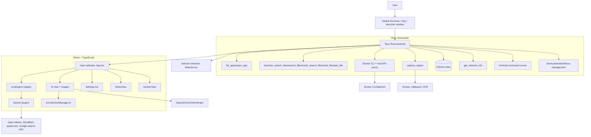
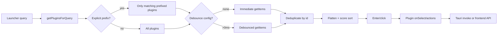

# GQuick Architecture

GQuick is a Tauri v2 desktop launcher with a React 19 frontend. The app combines a Spotlight-like search UI, plugin search/actions, AI chat with provider-specific streaming and tool calling, screenshot/OCR capture, notes, Docker management, weather, speed test, network diagnostics, translation, file/app search, calculator, web search, and inline terminal execution.

## System map

## Runtime data flow

## Key corrections from validation

- Plugin tool manager lives at `src/utils/toolManager.ts`, not `src/plugins/toolManager.ts`.
- Settings currently exposes OpenAI, Google Gemini, and Anthropic; Kimi/Moonshot code paths remain hidden.
- Current plugin registry includes `speedtestPlugin`; older docs omitted it.
- Docker plugin no longer exposes AI tools in current code. Docker search/actions are UI/plugin-driven and backed by Rust commands plus frontend Docker Hub search.
- Web Search plugin does not expose an AI tool. OpenAI hosted web search support is handled in `App.tsx`/streaming for supported OpenAI Responses models.
- File search is runtime `jwalk` scanning with safety policy, not a persistent file index.
- `recentFilesPlugin` is an immediate plugin that surfaces recently opened files/folders from `localStorage` usage history above filesystem scan results.
- Backend command surface now includes Docker Compose/logs/exec/inspect/prune, Docker Hub search, inline terminal commands, `quit_app`, and `hide_main_window`.

## Documentation index

- `arch/context.md` — Navigator-facing architecture context.
- `arch/plugin-system.md` — plugin interface, registry, routing, lifecycle.
- `arch/plugins.md` — current plugin catalog and capabilities.
- `arch/recent-files-plugin.md` — immediate plugin that surfaces recently opened files/folders from usage history.
- `arch/plugin-tools.md` — AI tool-calling architecture and current tool inventory.
- `arch/backend-tauri.md` — Rust command surface and cross-platform integrations.
- `arch/data/flows.md` — major app data flows.
- `arch/data/models.md` — key data models and schemas.
- `arch/api/contracts.md` — Tauri/frontend/API contracts.
- `arch/api/sequences.md` — sequence diagrams.
- `arch/components/relationships.md` — component relationships.
