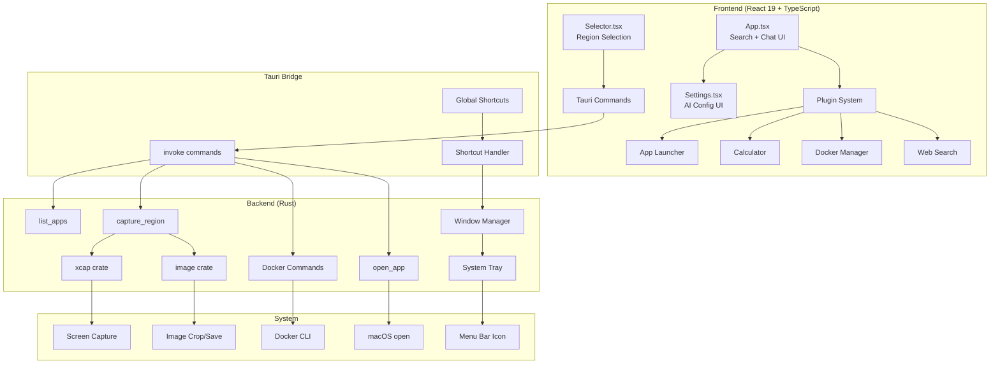
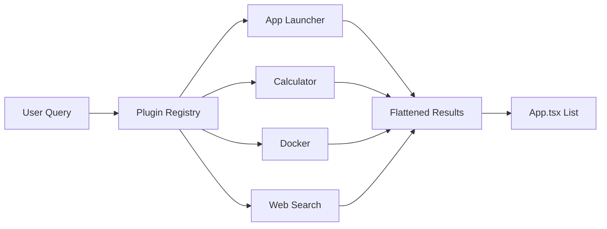

# GQuick Architecture Overview

GQuick is a macOS productivity launcher built with **Tauri 2.0** (Rust backend) and **React 19** (TypeScript frontend).

## System Architecture



## Window Architecture

GQuick uses two Tauri windows:

1. **"main"** — The launcher interface (search, chat, settings)
2. **"selector"** — Fullscreen transparent overlay for region selection

Both share the same HTML entry point; `main.tsx` routes based on `window.label`.

## Plugin Architecture

The plugin system allows decoupled search providers:



Each plugin implements `GQuickPlugin`:
- `metadata`: ID, title, icon, keywords
- `getItems(query)`: Returns `Promise<SearchResultItem[]>`

## Data Flow

### Search Flow
```
User Input → Debounce (50ms) → Parallel Plugin Queries → Flatten → Render
```

### Screenshot/OCR Flow
```
Alt+S/O → Create Selector Window → User Drags Region → 
Send Coords to Rust → Hide Window → 150ms Delay → 
xcap Capture → Crop → Save to Desktop → Handle Mode
```

### Chat Flow (Mocked)
```
User Message → Local State Update → 600ms Delay → 
Mock Response → Local State Update
```

## Key Design Decisions

1. **Rust handles all screen capture**: Avoids browser security restrictions
2. **Single HTML with window routing**: Simplifies build, shared CSS/JS
3. **localStorage for settings**: Simple but insecure for API keys
4. **Plugin system**: Easy to add new search providers
5. **Transparent borderless windows**: Native Spotlight-like feel
