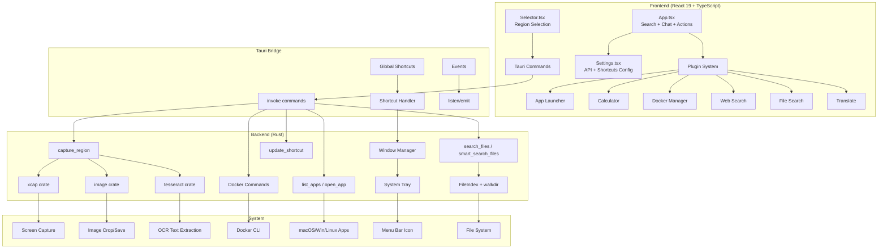
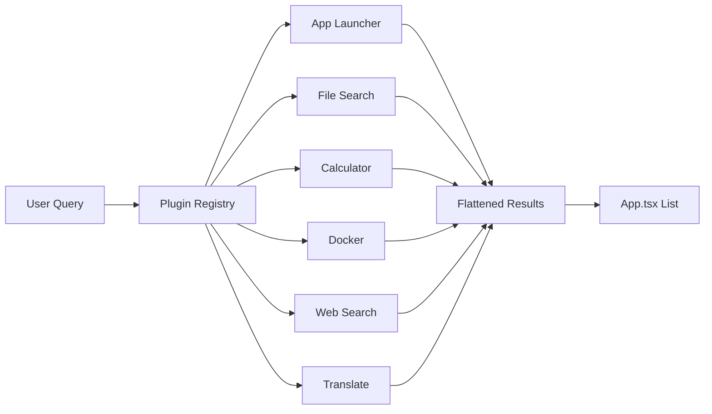

# GQuick Architecture Overview

GQuick is a cross-platform desktop productivity launcher built with **Tauri 2.0** (Rust backend) and **React 19** (TypeScript frontend).

## System Architecture



## Window Architecture

GQuick uses two Tauri windows:

1. **"main"** — The launcher interface (search, chat, settings, actions)
2. **"selector"** — Fullscreen transparent overlay for region selection

Both share the same HTML entry point; `main.tsx` routes based on `window.label`.

## Plugin Architecture

The plugin system allows decoupled search providers:



Each plugin implements `GQuickPlugin`:
- `metadata`: ID, title, icon, keywords, subtitle
- `getItems(query)`: Returns `Promise<SearchResultItem[]>`

## Data Flow

### Search Flow
```
User Input → Debounce (150ms) → Parallel Plugin Queries → Flatten + Sort → Render
```

### Screenshot/OCR Flow
```
Alt+S/O → Create Selector Window → User Drags Region → 
Send Coords to Rust → Hide Window → 150ms Delay → 
xcap Capture → Crop → Save to Desktop → Handle Mode
(screenshot: copy image to clipboard | ocr: run Tesseract → copy text to clipboard)
```

### AI Chat Flow (Real Streaming)
```
User Message + Optional Images → Provider-specific SSE streaming →
Real-time Markdown rendering in chat UI
```

### Quick Translate Flow
```
User types "t: text" or "> text" → 400ms debounce → AI API call →
Single result display → Enter copies to clipboard
```

## Key Design Decisions

1. **Rust handles all screen capture and OCR**: Avoids browser security restrictions; Tesseract runs locally
2. **Single HTML with window routing**: Simplifies build, shared CSS/JS
3. **localStorage for settings**: Simple but insecure for API keys
4. **Plugin system**: Easy to add new search providers
5. **Transparent borderless windows**: Native Spotlight-like feel
6. **Real AI streaming via SSE**: Responsive chat experience across all providers
7. **File index with caching**: 5-minute TTL, home directory, max depth 6
