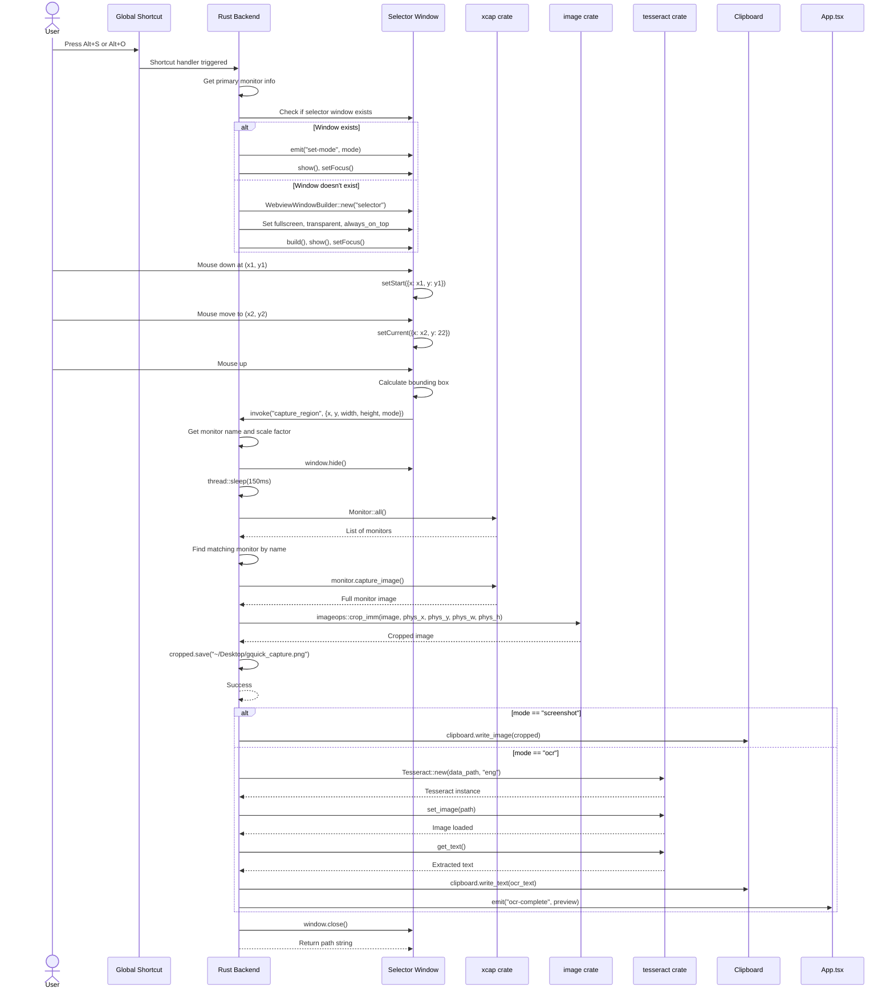
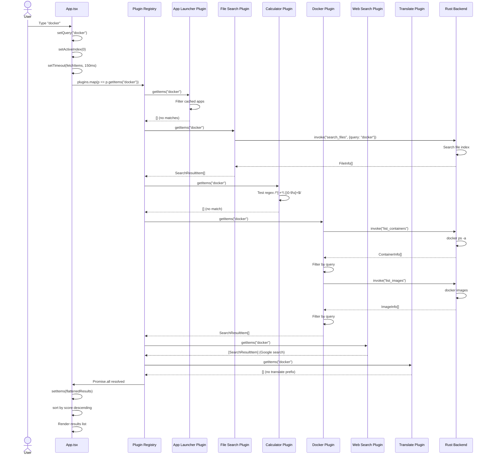
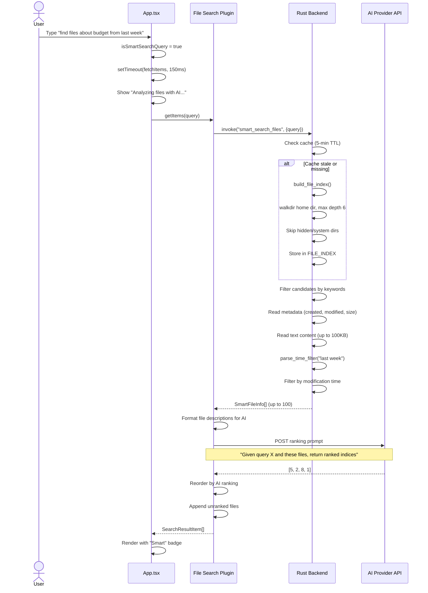
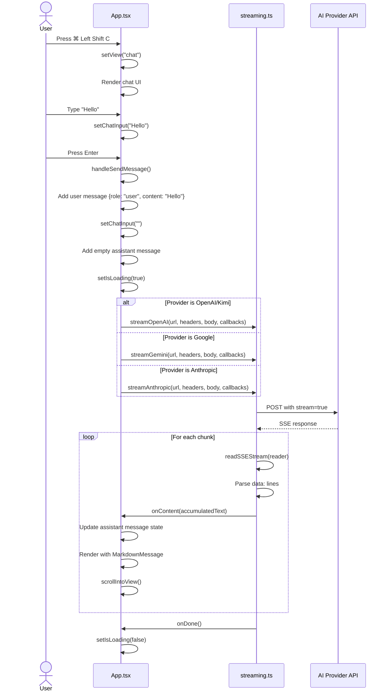
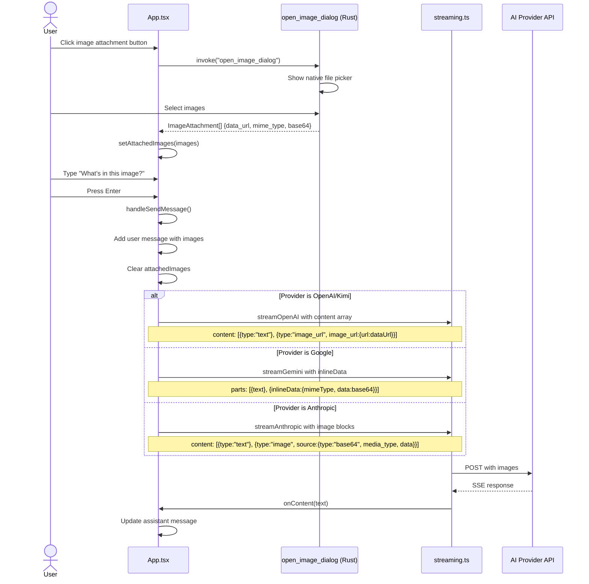
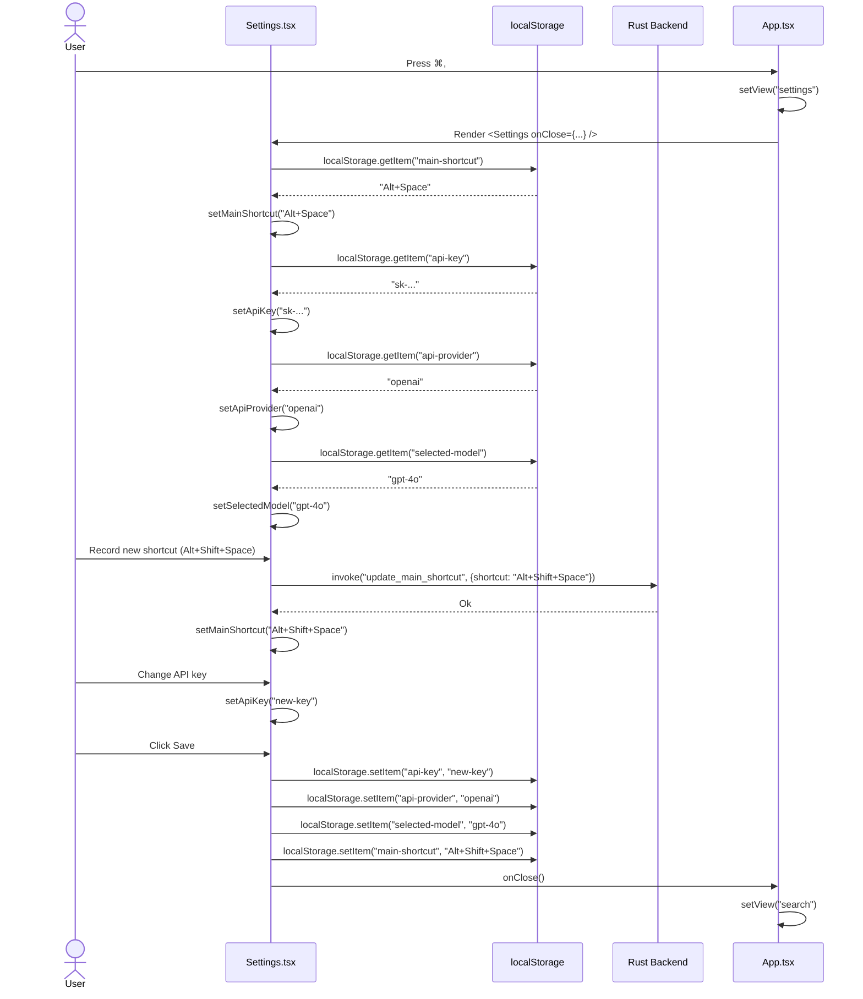
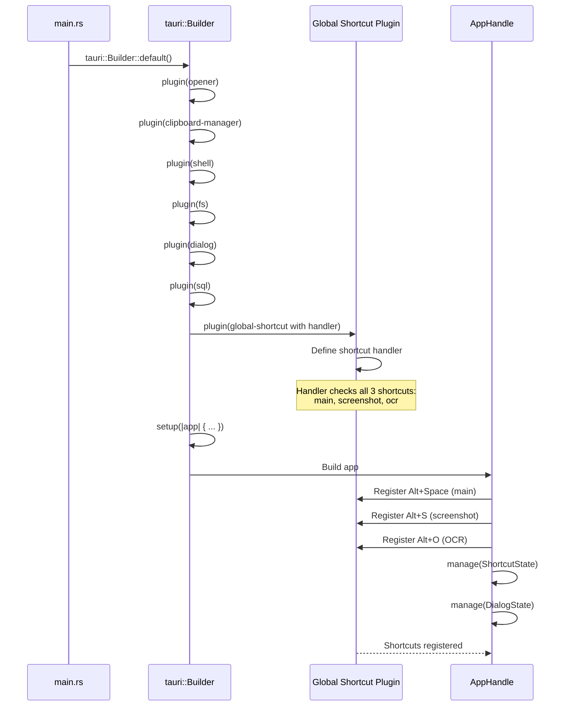
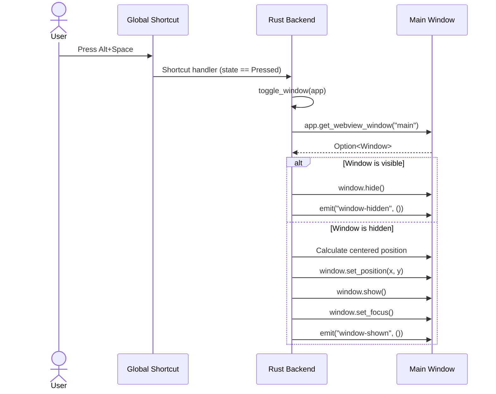
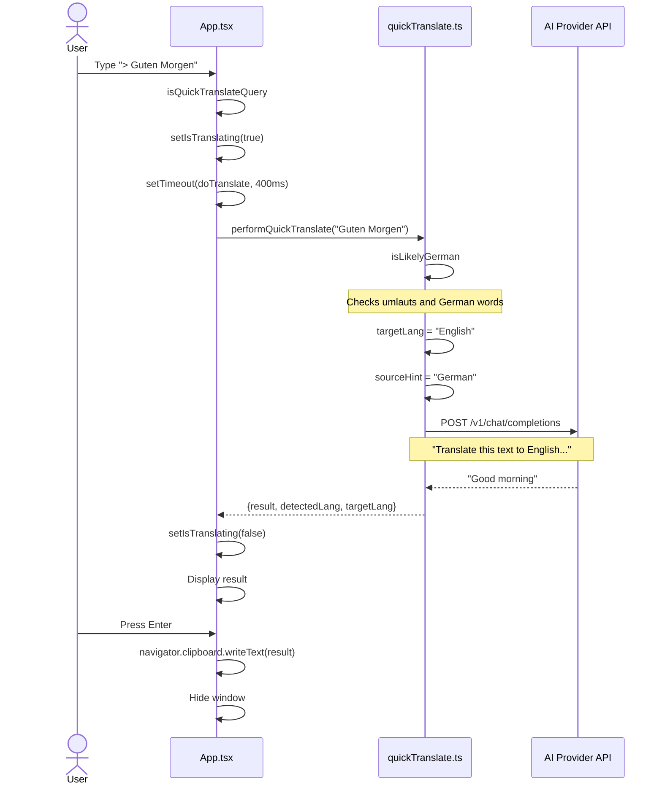

# API Interaction Sequences

## Screen Capture Sequence

## Plugin Search Sequence

## Smart File Search Sequence

## Chat Message Sequence (Real Streaming)

## Chat with Image Attachments Sequence

## Settings Save Sequence

## Global Shortcut Registration Sequence

## Window Toggle Sequence

## Quick Translate Sequence

