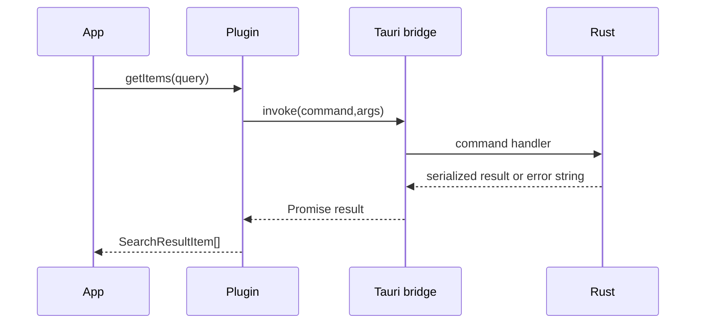
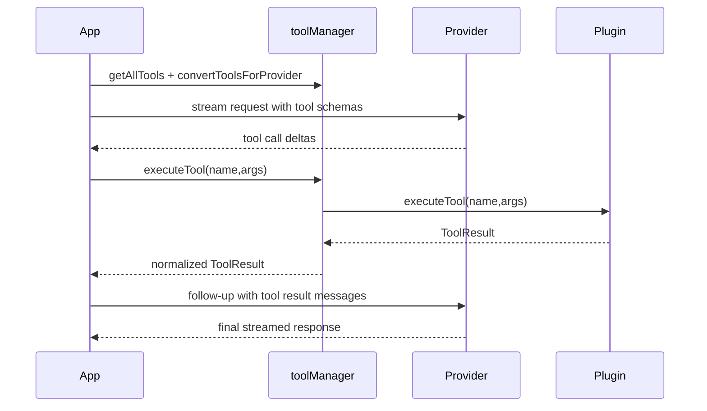
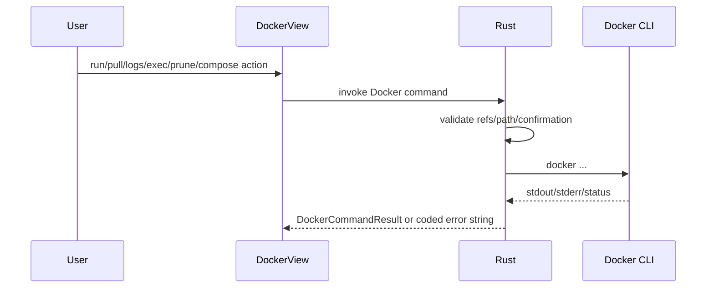
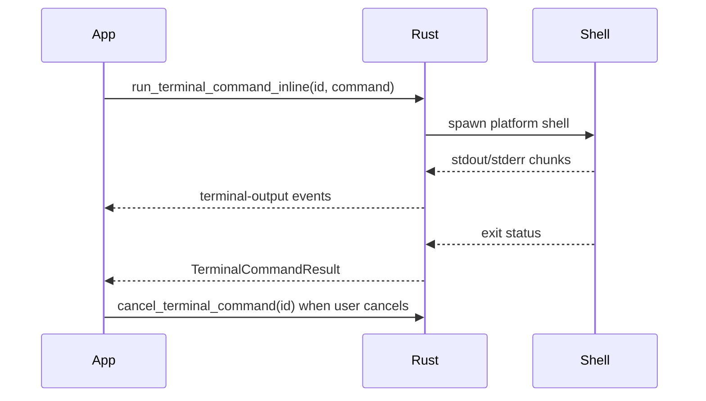
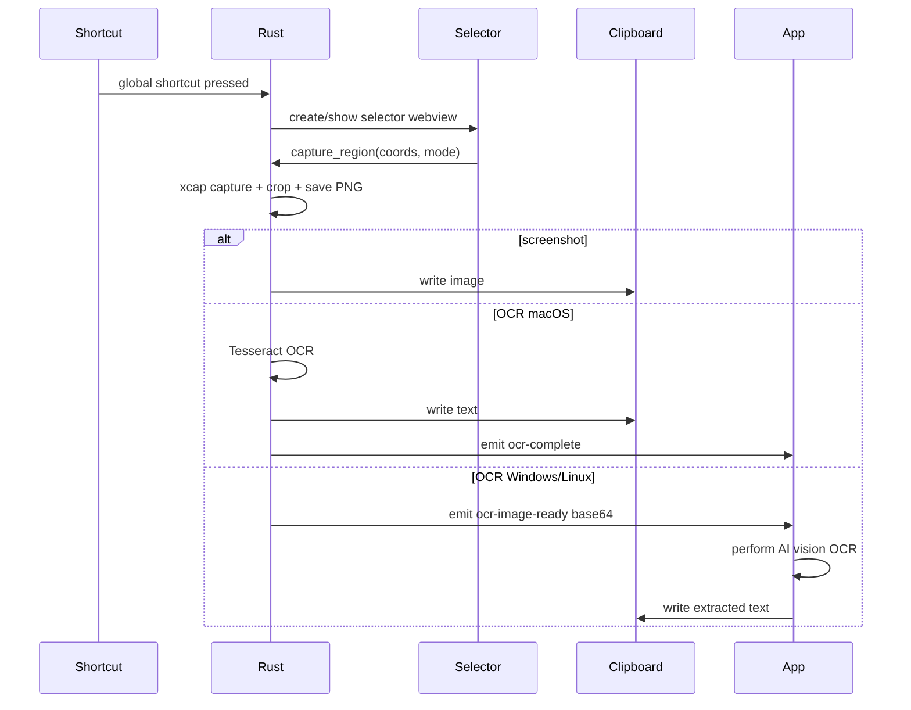

# API Interaction Sequences

## Plugin search to Tauri command

```mermaid
sequenceDiagram
  participant App
  participant Plugin
  participant Tauri as Tauri bridge
  participant Rust

  App->>Plugin: getItems(query)
  Plugin->>Tauri: invoke(command,args)
  Tauri->>Rust: command handler
  Rust-->>Tauri: serialized result or error string
  Tauri-->>Plugin: Promise result
  Plugin-->>App: SearchResultItem[]
```

## AI tool calling

```mermaid
sequenceDiagram
  participant App
  participant Tools as toolManager
  participant Provider
  participant Plugin

  App->>Tools: getAllTools + convertToolsForProvider
  App->>Provider: stream request with tool schemas
  Provider-->>App: tool call deltas
  App->>Tools: executeTool(name,args)
  Tools->>Plugin: executeTool(name,args)
  Plugin-->>Tools: ToolResult
  Tools-->>App: normalized ToolResult
  App->>Provider: follow-up with tool result messages
  Provider-->>App: final streamed response
```

## Docker UI operation

```mermaid
sequenceDiagram
  participant User
  participant DockerView
  participant Rust
  participant Docker as Docker CLI

  User->>DockerView: run/pull/logs/exec/prune/compose action
  DockerView->>Rust: invoke Docker command
  Rust->>Rust: validate refs/path/confirmation
  Rust->>Docker: docker ...
  Docker-->>Rust: stdout/stderr/status
  Rust-->>DockerView: DockerCommandResult or coded error string
```

## Inline terminal command

```mermaid
sequenceDiagram
  participant App
  participant Rust
  participant Shell

  App->>Rust: run_terminal_command_inline(id, command)
  Rust->>Shell: spawn platform shell
  Shell-->>Rust: stdout/stderr chunks
  Rust-->>App: terminal-output events
  Shell-->>Rust: exit status
  Rust-->>App: TerminalCommandResult
  App->>Rust: cancel_terminal_command(id) when user cancels
```

## Screenshot/OCR

```mermaid
sequenceDiagram
  participant Shortcut
  participant Rust
  participant Selector
  participant Clipboard
  participant App

  Shortcut->>Rust: global shortcut pressed
  Rust->>Selector: create/show selector webview
  Selector->>Rust: capture_region(coords, mode)
  Rust->>Rust: xcap capture + crop + save PNG
  alt screenshot
    Rust->>Clipboard: write image
  else OCR macOS
    Rust->>Rust: Tesseract OCR
    Rust->>Clipboard: write text
    Rust->>App: emit ocr-complete
  else OCR Windows/Linux
    Rust->>App: emit ocr-image-ready base64
    App->>App: perform AI vision OCR
    App->>Clipboard: write extracted text
  end
```
