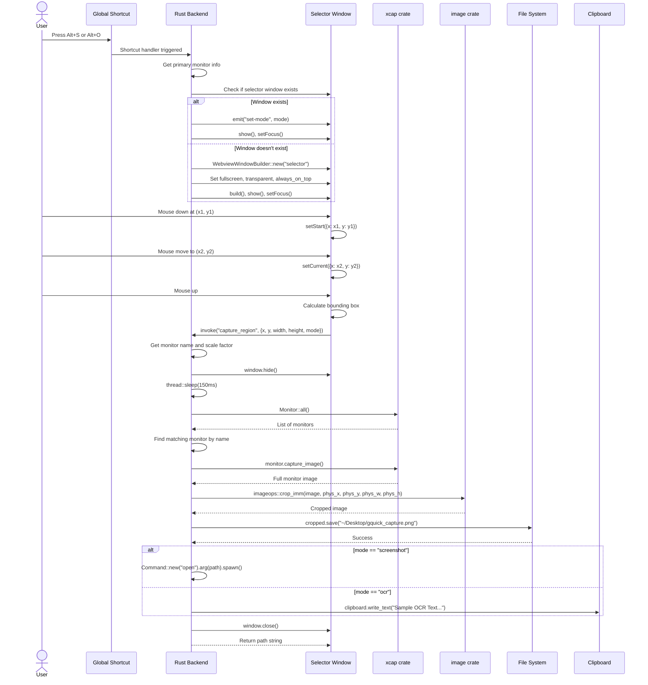
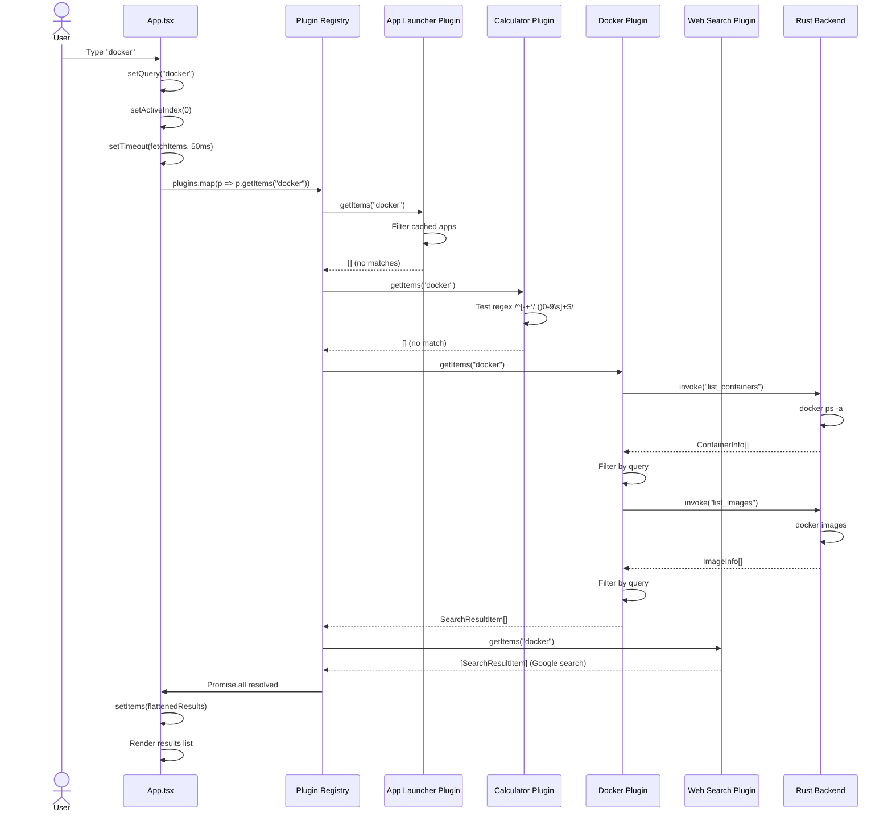
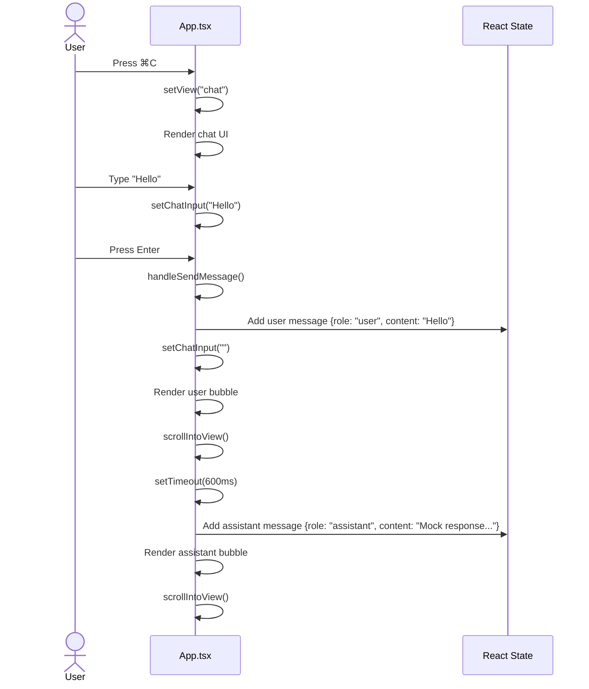
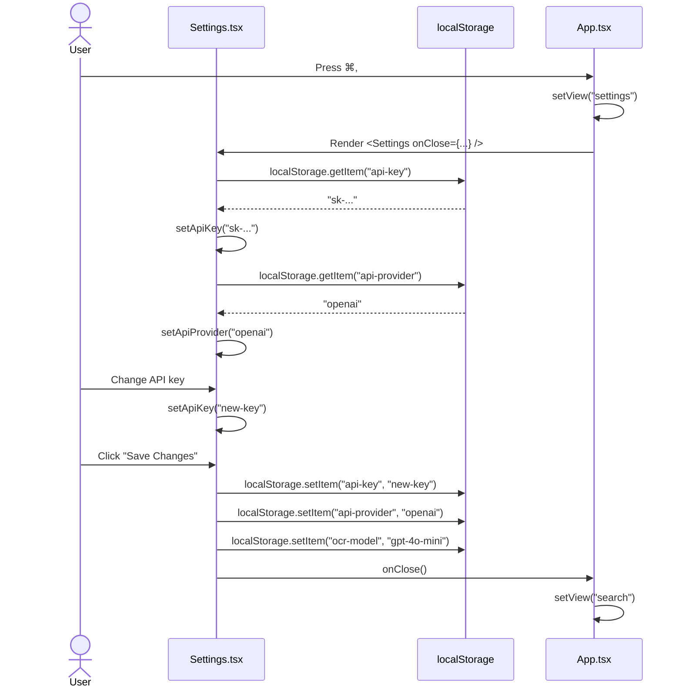
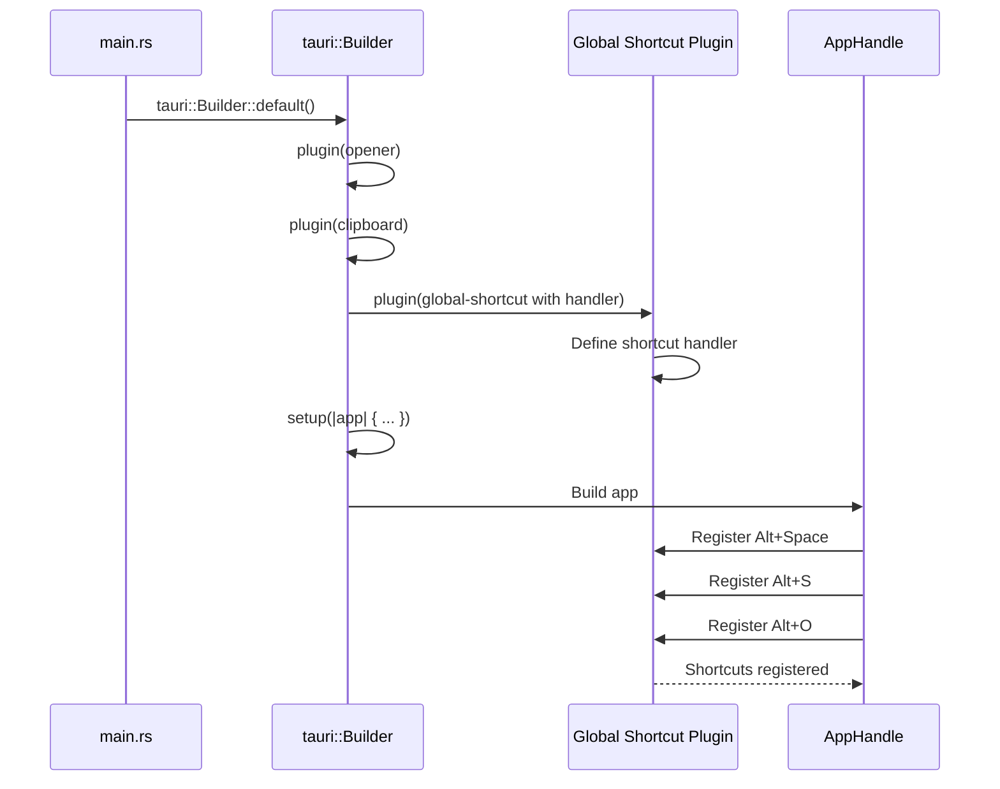
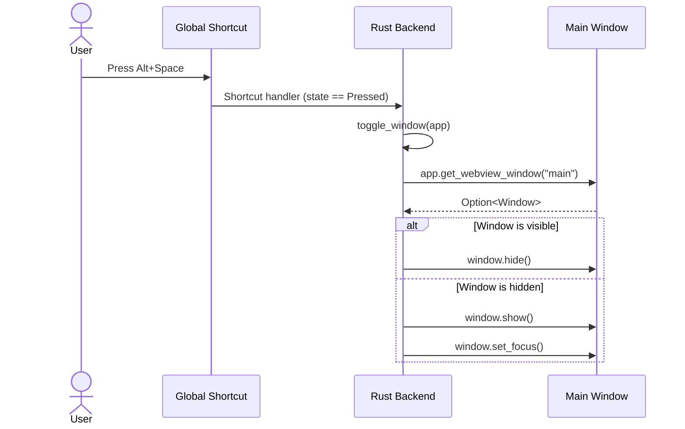

# API Interaction Sequences

## Screen Capture Sequence

## Plugin Search Sequence

## Chat Message Sequence (Mocked)

## Settings Save Sequence

## Global Shortcut Registration Sequence

## Window Toggle Sequence

