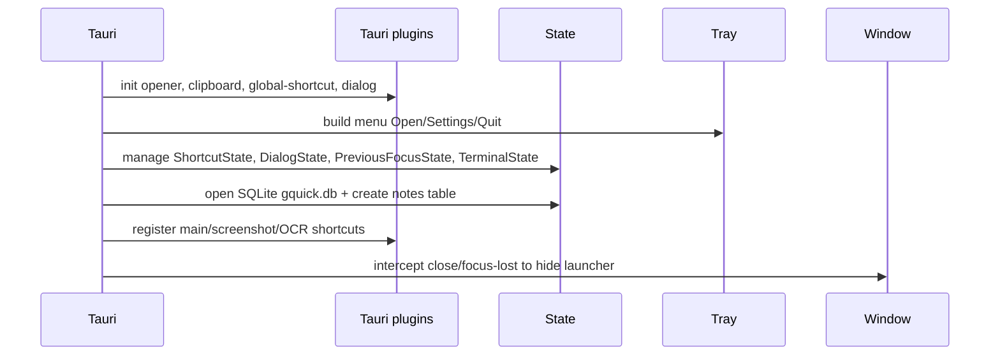
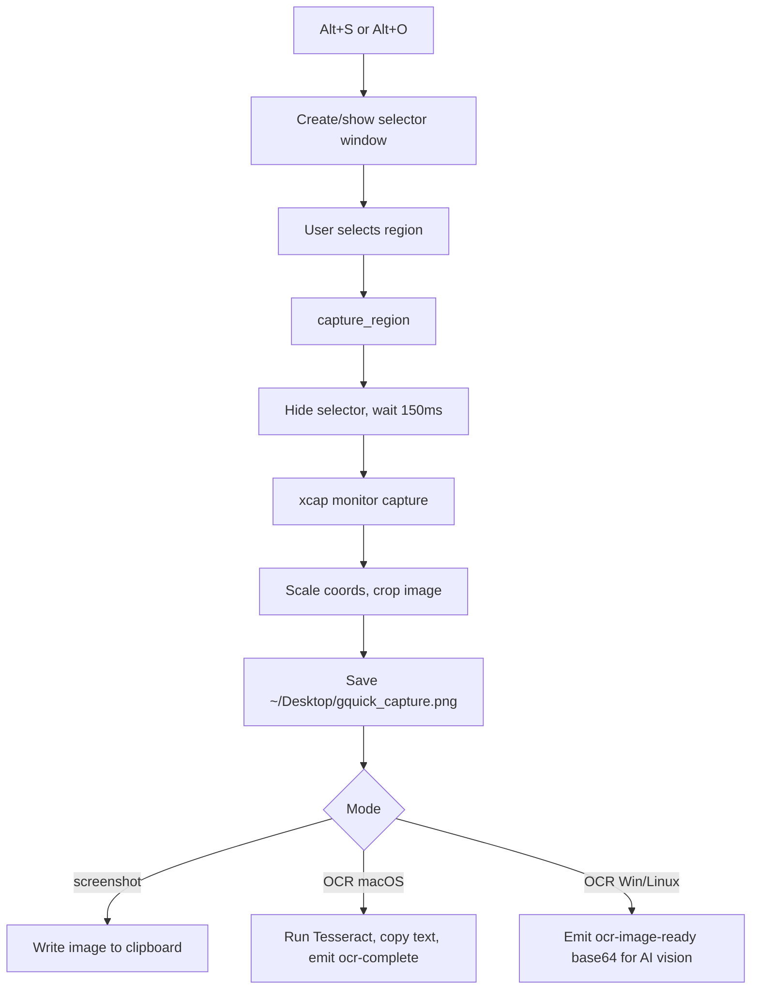

# Tauri Backend and Cross-Platform Integrations

Source of truth: `src-tauri/src/lib.rs`, `src-tauri/Cargo.toml`.

## Backend responsibilities

- Window lifecycle: hidden launcher window, selector window, focus restoration, tray menu.
- Global shortcuts: main launcher, screenshot, OCR, dynamic shortcut updates.
- System integration: app listing/launching, file open/search, network info, screenshot/OCR, clipboard, native dialogs.
- Local persistence: SQLite notes database in app data directory.
- Docker CLI operations and Docker Hub search proxy.
- Terminal command opening/running/canceling.

## Registered commands

| Area | Commands |
|---|---|
| App/window | `greet`, `quit_app`, `hide_main_window`, `close_selector` |
| Apps | `list_apps`, `open_app` |
| Network | `get_network_info` |
| Docker status/search | `docker_status`, `search_docker_hub` |
| Docker local | `list_containers`, `list_images`, `delete_image`, `manage_container`, `pull_image`, `run_container`, `container_logs`, `exec_container`, `inspect_docker`, `prune_docker` |
| Docker Compose | `compose_read_file`, `compose_write_file`, `compose_action` |
| Capture/OCR | `capture_region` |
| Files | `search_files`, `launcher_search_files`, `smart_search_files`, `read_file`, `open_file` |
| Shortcuts | `update_main_shortcut`, `update_screenshot_shortcut`, `update_ocr_shortcut` |
| Dialog/image attachment | `open_image_dialog` |
| Notes | `create_note`, `get_notes`, `update_note`, `delete_note`, `search_notes`, `get_note_by_id` |
| Terminal | `open_terminal_command`, `run_terminal_command_inline`, `cancel_terminal_command`, `cancel_all_terminal_commands` |

## Cross-platform behavior

| Feature | macOS | Windows | Linux |
|---|---|---|---|
| Default launcher shortcut | `Alt+Space` | `Alt+Shift+Space` | `Alt+Space` |
| App discovery | `/Applications`, `/System/Applications`, `~/Applications`, app icon extraction/caching | Start Menu `.lnk` files | `.desktop` entries in application dirs |
| App launch | `open` | `cmd /C start` | `xdg-open` |
| OCR | Native Tesseract command path through `tesseract` crate | Emits base64 image for frontend AI vision OCR | Emits base64 image for frontend AI vision OCR |
| Terminal open | Terminal.app via `osascript` argv | `cmd /K` | Tries common terminal emulators |
| Inline command shell | `sh -lc`, own process group | `cmd /C`, canceled via `taskkill` | `sh -lc`, own process group |

## Startup and lifecycle

## Screenshot/OCR flow

## Safety boundaries

- Docker destructive operations require explicit `confirmed` values for remove/kill/delete/prune/compose volume removal/compose overwrite.
- Docker references and compose paths are validated before invoking the CLI.
- File read tool rejects unsafe/hidden/symlink/secret/outside-root paths and clamps max bytes.
- Inline terminal only runs one command at a time and asks frontend to confirm close/hide while command is running.
