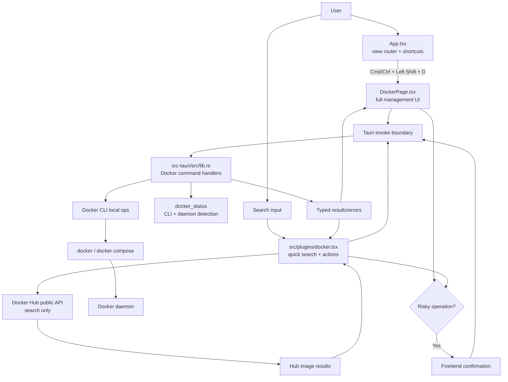

# Docker Architecture

## Current State

Docker support is currently split between:

- `src/plugins/docker.tsx` — frontend search plugin, result actions, preview buttons.
- `src-tauri/src/lib.rs` — Tauri commands that shell out to Docker CLI.
- `src/App.tsx` — global in-app shortcuts and view routing; currently no dedicated Docker view.

Implemented backend commands are limited to `list_containers`, `list_images`, `manage_container`, and `delete_image`.

## Target Architecture

Docker should become both a launcher plugin and a dedicated management surface opened by `Cmd/Ctrl + Left Shift + D`.



## Frontend / Backend Boundary

### Frontend responsibilities

- Search Docker Hub via Docker Hub public API (`https://hub.docker.com/v2/search/repositories/?query=...`) from `src/plugins/docker.tsx` or a Docker API utility.
- Render search result action menus: pull, run, inspect local match, open Hub page.
- Own confirmations for risky operations before invoking Rust commands.
- Own Docker page state, tabs, forms, compose editor UI, logs display, exec-shell terminal UI.
- Pass structured inputs to backend; never build shell command strings in frontend.

### Backend responsibilities

- Execute local Docker operations through `std::process::Command` with argument arrays.
- Detect Docker CLI presence and daemon readiness before local commands.
- Validate action enums and user-provided names/ports/env/volume mappings.
- Return typed JSON data and clear error codes/messages.
- Read/write compose files only at user-selected or explicitly supplied paths.

## Command Surface Needed

| Command | Purpose | Notes |
|---------|---------|-------|
| `docker_status` | Detect CLI and daemon | Run `docker --version`; then `docker info` with timeout. Return `cli_installed`, `daemon_running`, versions, compose support. |
| `list_containers` | Existing; extend fields | Prefer `docker ps -a --format '{{json .}}'` for safer parsing. Add ports, state, created, labels. |
| `list_images` | Existing; extend fields | Prefer JSON format. Add repo tags/digests if needed. |
| `manage_container` | Existing; restrict enum | Allow `start`, `stop`, `restart`, `pause`, `unpause`, `remove`, `kill`; confirmation required for remove/kill. |
| `pull_image` | Pull image by reference | Stream progress later if needed; initial version can return stdout/stderr. |
| `run_container` | Run image | Supports detached/interactive, ports, env, volumes, name, command. Interactive requires dedicated terminal/pty decision. |
| `container_logs` | Fetch logs | Support tail/follow. Follow needs events or sidecar process cleanup. |
| `exec_container` | Run exec command/shell | Non-interactive command first; interactive shell needs pty bridge. |
| `inspect_docker` | Inspect image/container | `docker inspect <id>` returns JSON value/string. |
| `delete_image` | Existing; make force optional | Confirmation required; avoid unconditional `-f` default. |
| `prune_docker` | Prune containers/images/volumes/system | Confirmation required; return reclaimed space from stdout. |
| `compose_list_paths` | Return known compose paths | Existing/recent paths can live in localStorage frontend or backend app data. |
| `compose_read_file` | Read compose YAML | Validate path exists and is file. |
| `compose_write_file` | Create/edit compose YAML | Use explicit save path; warn before overwrite. |
| `compose_action` | `up`, `down`, `pull`, `logs`, `ps`, `restart` | Prefer `docker compose`; fallback detection for legacy `docker-compose` if supported. |

## Suggested Data Models

```typescript
type DockerErrorCode = "CLI_MISSING" | "DAEMON_DOWN" | "COMMAND_FAILED" | "VALIDATION_FAILED" | "TIMEOUT";

interface DockerStatus {
  cliInstalled: boolean;
  daemonRunning: boolean;
  dockerVersion?: string;
  composeAvailable: boolean;
  composeVersion?: string;
  error?: { code: DockerErrorCode; message: string; hint?: string };
}

interface DockerHubResult {
  name: string;
  namespace: string;
  repositoryName: string;
  description: string;
  starCount: number;
  pullCount: number;
  isOfficial: boolean;
  isAutomated: boolean;
}

interface RunContainerOptions {
  image: string;
  name?: string;
  detached: boolean;
  interactive: boolean;
  ports: Array<{ host: string; container: string; protocol?: "tcp" | "udp" }>;
  env: Array<{ key: string; value: string }>;
  volumes: Array<{ host: string; container: string; readonly?: boolean }>;
  command?: string[];
  removeWhenExit?: boolean;
}
```

## Error Handling Requirements

- Docker CLI missing: return `CLI_MISSING` with install hint; frontend shows empty/error state, not silent `[]`.
- Daemon not running: return `DAEMON_DOWN` with platform hint (`Docker Desktop` on macOS/Windows; service/socket on Linux).
- Docker Hub failure: keep local Docker management usable; show API-specific error on Hub results only.
- Command stderr: preserve stderr in `COMMAND_FAILED`, but normalize known daemon/permission errors.
- Long-running operations: add timeout/cancellation strategy; pulls and compose up can hang.

## Risky Operations Requiring Confirmation

- Remove container, kill container, delete image, force delete image.
- Prune containers/images/volumes/system, especially volumes.
- Compose `down --volumes`, compose file overwrite/delete.
- Running containers with host bind mounts, privileged mode, host network, or exposed ports.
- Exec interactive shell into running container.

## Cross-Platform Caveats

- Docker Desktop may not be running even when CLI exists on macOS/Windows.
- Linux users may have Docker installed but lack socket permission; surface permission error distinctly.
- Use `docker compose` plugin when available; legacy `docker-compose` may not exist.
- Interactive shells need PTY support. Plain `Command::output()` cannot provide true interactive `-it` sessions.
- Path handling for volumes differs: Windows drive paths need careful validation/quoting, but still pass as args not shell strings.
- Docker Hub public API is unauthenticated and rate-limited; implement debounce/cache for searches.
