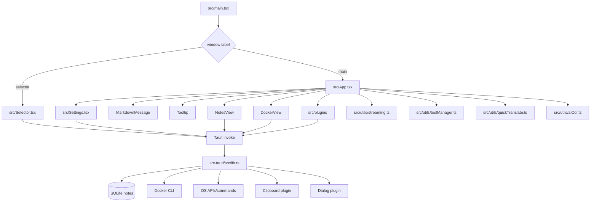

# Component Relationships

## Frontend responsibilities

- `App.tsx`: primary UI state machine for search/chat/settings/actions/notes/docker views; plugin query orchestration; keyboard shortcuts; chat streaming/tool execution; inline terminal UI.
- `Settings.tsx`: provider/model/API key and shortcut configuration.
- `Selector.tsx`: region selection overlay for screenshot/OCR.
- `DockerView.tsx`: full Docker manager for status, Hub/local images, containers, logs, exec, inspect, prune, compose.
- `NotesView.tsx`: CRUD notes manager.
- `src/plugins/*`: plugin search results, action items, previews, optional AI tools.
- `src/utils/toolManager.ts`: tool discovery/conversion/execution and provider-specific message conversion.
- `src/utils/streaming.ts`: SSE streaming for provider APIs.

## Backend responsibilities

- Tauri command dispatch and cross-platform system integration.
- SQLite setup and notes CRUD.
- Docker CLI and compose command execution with validation and timeout handling.
- Runtime file search and safe AI read policy.
- Shortcut/tray/window/focus lifecycle.
- Screenshot/OCR capture path.

## Shared conventions

- Plugins communicate upward via `SearchResultItem` callbacks or custom DOM events.
- Long-running/expensive plugins use prefixes, debounce, or both.
- Backend errors return `String` values; Docker errors embed code/message JSON strings via helper.
- UI hides launcher instead of closing main window except quit flow.
