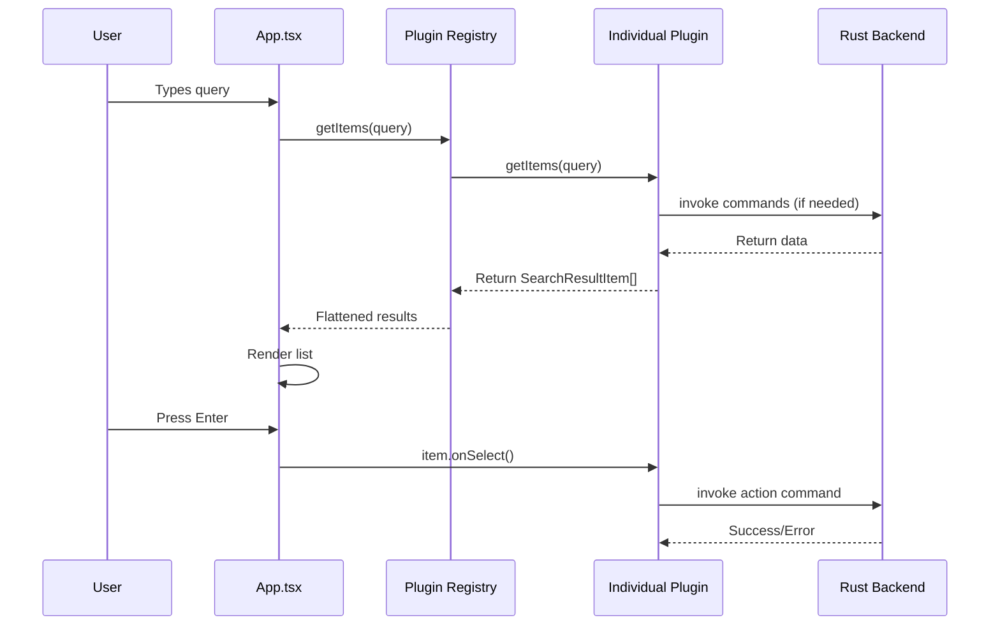
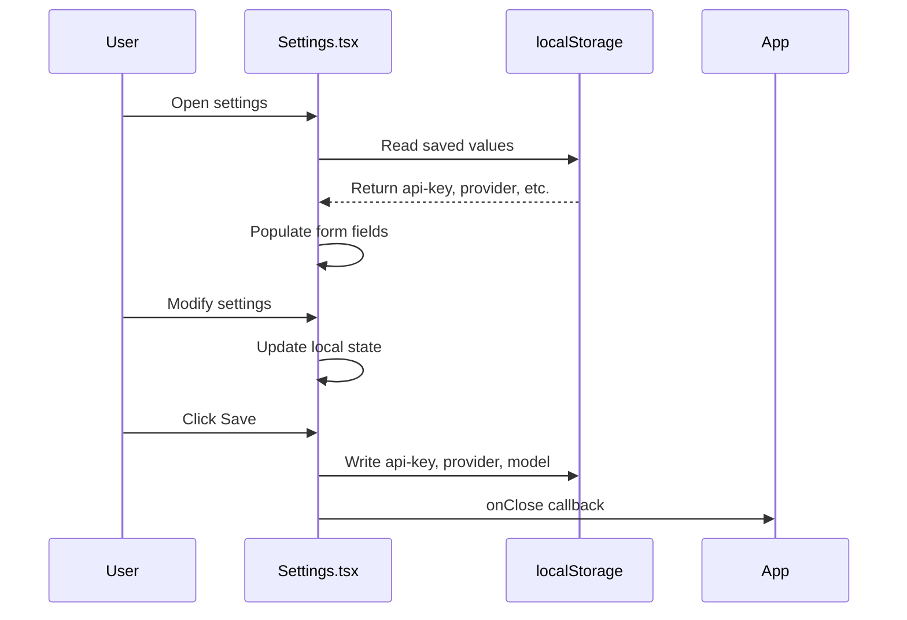
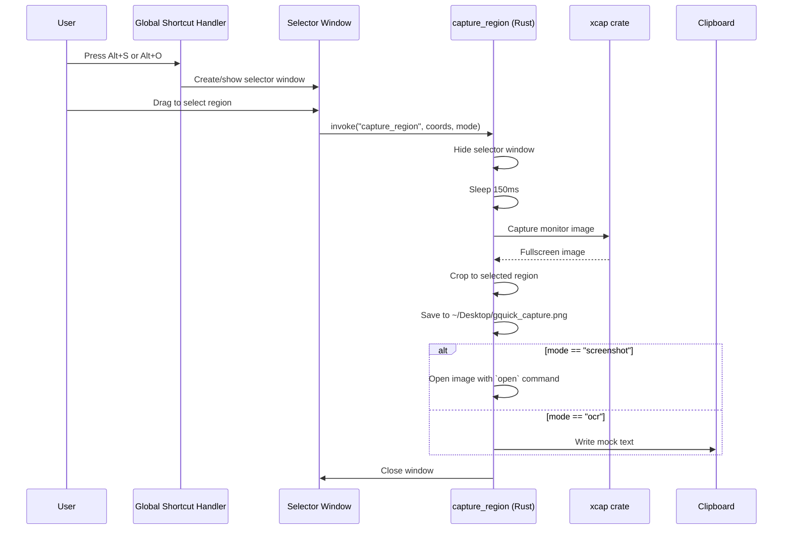
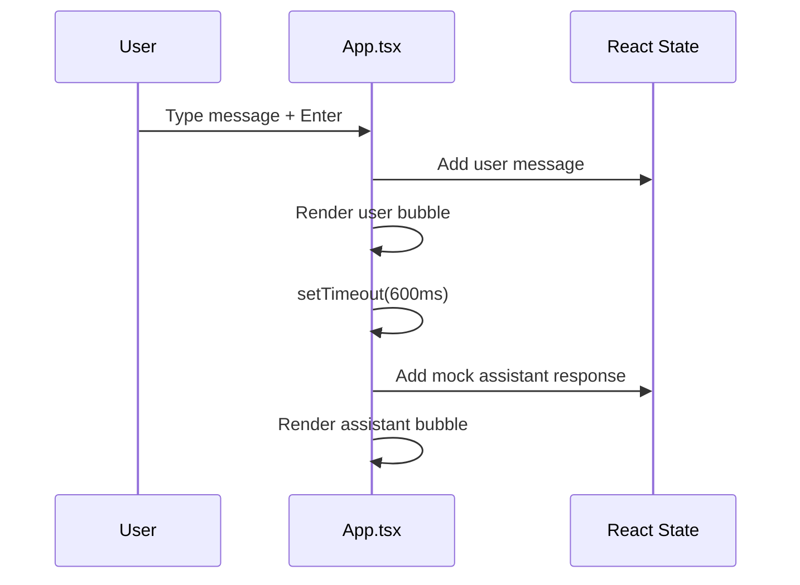

# Component Interactions

## Frontend-Backend Communication

### Tauri Commands

The frontend invokes Rust commands via `@tauri-apps/api/core`:

```typescript
import { invoke } from "@tauri-apps/api/core";

// App Launcher
const apps = await invoke<AppInfo[]>("list_apps");
await invoke("open_app", { path: app.path });

// Docker
const containers = await invoke<ContainerInfo[]>("list_containers");
const images = await invoke<ImageInfo[]>("list_images");
await invoke("manage_container", { id: c.id, action: "stop" });
await invoke("delete_image", { id: img.id });

// Screen Capture
await invoke("capture_region", { 
  x, y, width, height, mode: "screenshot" | "ocr" 
});
```

### Tauri Events

The backend emits events to the frontend:

```typescript
import { listen } from "@tauri-apps/api/event";

// Selector window listens for mode changes
const unlisten = await listen<string>("set-mode", (event) => {
  setMode(event.payload);
});
```

### Window Management

```typescript
import { getCurrentWindow } from "@tauri-apps/api/window";

// Hide window
await getCurrentWindow().hide();

// Close window
await getCurrentWindow().close();
```

## Plugin Data Flow



## Settings Data Flow



## Screen Capture Data Flow



## Chat Data Flow (Mocked)



## Dependency Graph

```mermaid
graph LR
    subgraph "Frontend"
        A[App.tsx]
        S[Settings.tsx]
        Se[Selector.tsx]
        M[main.tsx]
        P[Plugins]
    end

    subgraph "Tauri API"
        T1[@tauri-apps/api/core]
        T2[@tauri-apps/api/window]
        T3[@tauri-apps/api/event]
    end

    subgraph "Tauri Plugins"
        TP1[@tauri-apps/plugin-opener]
        TP2[@tauri-apps/plugin-clipboard-manager]
    end

    A --> T1
    A --> T2
    A --> P
    A --> S
    Se --> T1
    Se --> T2
    Se --> T3
    M --> T2
    P --> T1
    P --> TP1
```
