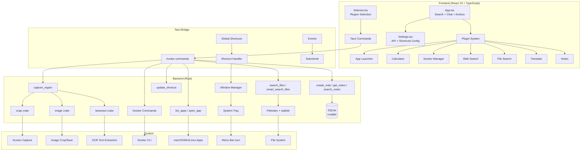

# Project Context

## Overview

**GQuick** is a cross-platform desktop productivity launcher built with **Tauri v2** (Rust backend) and **React 19** (TypeScript frontend). It provides a Spotlight-like interface with global keyboard shortcuts for quick app launching, file search (with AI-powered smart search), Docker management, calculations, web search, AI translation, screenshot capture, OCR text extraction, and a real AI chat interface with image support.

## Architecture Summary

GQuick follows a **Tauri 2.0 architecture** with a clear separation between a Rust-native backend (system integration, screen capture, OCR, file indexing, shortcuts, tray) and a React frontend (UI, plugin system, settings, AI chat). The app uses a transparent, borderless window that can be toggled via global shortcuts.



## Key Components

### Frontend Components

| Component | File | Responsibility |
|-----------|------|----------------|
| **App** | `src/App.tsx` | Main launcher: search input, results list, chat view, actions overlay, keyboard handling |
| **Selector** | `src/Selector.tsx` | Fullscreen transparent overlay for region selection (screenshot/OCR) |
| **Settings** | `src/Settings.tsx` | Configuration: API providers, API keys, model selection, global shortcut recording |
| **Root** | `src/main.tsx` | Window label router (App vs Selector based on Tauri window label) |
| **MarkdownMessage** | `src/components/MarkdownMessage.tsx` | Renders AI chat responses with Markdown, code blocks, tables, GFM |
| **Tooltip** | `src/components/Tooltip.tsx` | Hover tooltip component used in chat and UI |
| **ShortcutRecorder** | `src/components/ShortcutRecorder.tsx` | Interactive shortcut capture for settings |
| **NotesView** | `src/components/NotesView.tsx` | Full CRUD notes management UI |

### Backend Commands (Rust)

| Command | File | Responsibility |
|---------|------|----------------|
| `list_apps` | `src-tauri/src/lib.rs` | Scans system app directories (macOS `.app`, Windows `.lnk`, Linux `.desktop`) |
| `open_app` | `src-tauri/src/lib.rs` | Launches apps via `open` (macOS), `start` (Windows), `xdg-open` (Linux) |
| `capture_region` | `src-tauri/src/lib.rs` | Hides window, captures screen via `xcap`, crops region, saves to Desktop, runs OCR or copies to clipboard |
| `search_files` | `src-tauri/src/lib.rs` | Fast filename-based file search with keyword scoring |
| `smart_search_files` | `src-tauri/src/lib.rs` | AI-enhanced file search: reads file metadata, content previews, time filters |
| `open_file` | `src-tauri/src/lib.rs` | Opens files via `tauri-plugin-opener` |
| `list_containers` | `src-tauri/src/lib.rs` | Runs `docker ps -a` and parses output |
| `list_images` | `src-tauri/src/lib.rs` | Runs `docker images` and parses output |
| `manage_container` | `src-tauri/src/lib.rs` | Starts/stops/restarts Docker containers |
| `delete_image` | `src-tauri/src/lib.rs` | Removes Docker images |
| `update_main_shortcut` | `src-tauri/src/lib.rs` | Dynamically updates the global launcher shortcut |
| `update_screenshot_shortcut` | `src-tauri/src/lib.rs` | Dynamically updates the screenshot shortcut |
| `update_ocr_shortcut` | `src-tauri/src/lib.rs` | Dynamically updates the OCR shortcut |
| `open_image_dialog` | `src-tauri/src/lib.rs` | Native file picker for chat image attachments |
| `close_selector` | `src-tauri/src/lib.rs` | Closes the selector window from Rust |
| `greet` | `src-tauri/src/lib.rs` | Demo command (unused) |
| `create_note` | `src-tauri/src/lib.rs` | Creates a new note in SQLite |
| `get_notes` | `src-tauri/src/lib.rs` | Gets all notes ordered by updated_at desc |
| `update_note` | `src-tauri/src/lib.rs` | Updates note title/content |
| `delete_note` | `src-tauri/src/lib.rs` | Deletes a note |
| `search_notes` | `src-tauri/src/lib.rs` | Full-text search on title and content (with LIKE wildcard escaping) |
| `get_note_by_id` | `src-tauri/src/lib.rs` | Gets single note by ID |

### Plugin System

Located in `src/plugins/`. Each plugin implements `GQuickPlugin` interface:

- **appLauncher**: Lists and launches system applications (cross-platform)
- **fileSearch**: Fast filename search + AI-powered smart file search with content reading
- **calculator**: Evaluates math expressions in search bar
- **docker**: Manages Docker containers and images with inline actions
- **webSearch**: Opens Google search in default browser
- **translate**: AI-powered translation with quick-translate prefixes (`t:`, `tr:`, `>`) and full translation UI
- **notes**: Quick capture, search, and full CRUD notes management with SQLite persistence

## Data Flow

### Search Flow
```
User types query
    ↓
App.tsx debounces input (150ms)
    ↓
Calls all plugins' getItems(query) in parallel
    ↓
Flattens results, sorts by score descending
    ↓
Displays in scrollable list
    ↓
Arrow keys navigate, Enter selects
```

### Smart File Search Flow
```
User types smart query (e.g., "find files about budgeting from last week")
    ↓
smart_search_files Rust command
    ↓
Builds file index (cached 5 min), scans home dir max depth 6
    ↓
Returns candidates with metadata + content previews
    ↓
Frontend calls AI API to rank files by relevance
    ↓
Displays ranked results with "Smart" badge
```

### Screenshot/OCR Flow
```
User presses Alt+S (screenshot) or Alt+O (OCR)
    ↓
Rust backend creates "selector" window (fullscreen transparent)
    ↓
User drags to select region
    ↓
Selector.tsx sends coordinates to capture_region command
    ↓
Rust: hides selector → 150ms delay → xcap captures screen
    ↓
Crops region, saves to ~/Desktop/gquick_capture.png
    ↓
If screenshot mode: copies image to clipboard
If OCR mode: runs Tesseract OCR → copies text to clipboard + emits ocr-complete event
```

### AI Chat Flow (Real — Not Mocked)
```
User switches to chat view (⌘C or Actions menu)
    ↓
App.tsx renders chat UI with message history
    ↓
User sends message (+ optional image attachments up to 5)
    ↓
App.tsx calls streaming API based on selected provider:
    - OpenAI / Kimi → streamOpenAI (SSE)
    - Google Gemini → streamGemini (SSE)
    - Anthropic Claude → streamAnthropic (SSE)
    ↓
Assistant response streams in real-time with Markdown rendering
    ↓
Supports multi-turn conversation with image inputs
```

### Quick Translate Flow
```
User types "t: Hello world" or "> Guten Morgen"
    ↓
App.tsx detects quick-translate prefix (400ms debounce)
    ↓
Calls performQuickTranslate → detects language → calls AI API
    ↓
Displays single result; Enter copies to clipboard and hides window
```

### Note Quick Capture Flow
```
User types "note: Buy milk"
    ↓
notesPlugin detects prefix in getItems()
    ↓
Shows "Save note: Buy milk" result
    ↓
Enter → calls create_note Rust command
    ↓
Dispatches gquick-note-saved event
    ↓
Window hides
```

### Note Search Flow
```
User types "search notes: meeting"
    ↓
notesPlugin detects prefix
    ↓
Calls search_notes with query
    ↓
Returns matching notes as search results
    ↓
Enter → copies note content to clipboard
```

### AI Chat Notes Context Flow
```
User asks "What did I save about the project?"
    ↓
isNoteRelatedQuery detects note keywords
    ↓
fetchNotesContext calls search_notes
    ↓
Relevant notes prepended to system prompt
    ↓
UI shows amber "Notes used as context" banner
    ↓
AI responds with note-aware answer
```

## Technology Stack

### Frontend
- **Framework**: React 19.1.0 with TypeScript 5.8.3
- **Build Tool**: Vite 7.0.4
- **Styling**: Tailwind CSS 4.2.4 with `@tailwindcss/vite` plugin
- **Icons**: Lucide React 1.8.0
- **Markdown**: react-markdown 10.1.0 + remark-gfm 4.0.1
- **Utilities**: clsx 2.1.1, tailwind-merge 3.5.0

### Backend
- **Framework**: Tauri 2.0 (Rust)
- **Screen Capture**: xcap 0.9
- **Image Processing**: image 0.25
- **OCR**: tesseract 0.15
- **File Walking**: walkdir 2
- **Fuzzy Matching**: fuzzy-matcher 0.3
- **Date/Time**: chrono 0.4
- **Directories**: dirs 5
- **Serialization**: serde, serde_json
- **Base64**: base64 0.22
- **SQLite**: rusqlite 0.32

### Tauri Plugins Used
| Plugin | Purpose |
|--------|---------|
| `tauri-plugin-opener` | Open URLs and files in default apps |
| `tauri-plugin-clipboard-manager` | Write images and text to clipboard |
| `tauri-plugin-global-shortcut` | Register global shortcuts (Alt+Space/S/O) |
| `tauri-plugin-shell` | Execute system commands |
| `tauri-plugin-fs` | File system operations |
| `tauri-plugin-dialog` | Native file dialogs (image picker) |
| `tauri-plugin-sql` | SQLite database (notes use rusqlite directly) |

## Global Shortcuts

| Shortcut | Action | Configurable |
|----------|--------|-------------|
| `Alt + Space` | Toggle main window visibility | Yes (via Settings) |
| `Alt + S` | Open region selector (screenshot mode) | Yes (via Settings) |
| `Alt + O` | Open region selector (OCR mode) | Yes (via Settings) |
| `⌘K` / `Ctrl+K` | Toggle actions overlay | No |
| `⌘C` / `Ctrl+C` | Switch to chat view | No |
| `⌘,` / `Ctrl+,` | Open settings | No |
| `⌘R` / `Ctrl+R` | Clear chat (in chat view) | No |
| `⌘N` / `Ctrl+N` | Open notes view | No |
| `Escape` | Close/hide current view | No |

## AI Provider Integration

### Current State: Fully Implemented

The AI chat, translate, and smart file search features all make **real API calls** to configured providers.

### Supported Providers
- **OpenAI** — `https://api.openai.com/v1`
- **Kimi / Moonshot** — `https://api.moonshot.ai/v1`
- **Google Gemini** — `https://generativelanguage.googleapis.com/v1beta`
- **Anthropic Claude** — `https://api.anthropic.com/v1`

### Authentication
- **Method**: API key only (OAuth was removed)
- **Storage**: `localStorage` keys `api-key`, `api-provider`, `selected-model`
- **Security**: Keys stored in plaintext localStorage (known vulnerability)

### Features
- **Streaming responses**: Real-time SSE streaming for all providers
- **Model fetching**: Settings fetches live model lists from APIs (cached 24h)
- **Image inputs**: Chat supports up to 5 image attachments (vision models)
- **Multi-turn chat**: Full conversation history sent with each message

## OCR Implementation

### Current Implementation (Real Tesseract)
- **Trigger**: `Alt+O` global shortcut
- **Frontend**: `Selector.tsx` — fullscreen drag-to-select region
- **Backend**: `capture_region` command → `run_ocr()` function
- **Screen Capture**: Uses `xcap` crate to capture monitor, `image` crate to crop
- **OCR Engine**: **Tesseract** (`tesseract` crate 0.15) with English language model
- **macOS tessdata**: Looks in app resource directory for `tessdata/`
- **Output**: Extracted text written to clipboard; `ocr-complete` event emitted with preview
- **Save Location**: `~/Desktop/gquick_capture.png`

## File Search Implementation

### Fast Search (`search_files`)
- Keyword-based scoring on filename and path
- Returns top 50 results
- 5-minute file index cache
- Skips hidden dirs and common ignore patterns (`node_modules`, `.git`, `target`, etc.)

### Smart Search (`smart_search_files`)
- Natural language queries: "find files about X from last week"
- Reads file metadata (created, modified, size)
- Reads text file contents (up to 100KB) for preview
- Time filtering: `today`, `yesterday`, `last week`, `last month`, `recent`
- AI ranking: Sends file descriptions to configured AI model for relevance ranking

## Key Files and Responsibilities

| File | Responsibility |
|------|----------------|
| `src-tauri/src/lib.rs` | **Core backend**: all Tauri commands, shortcuts, tray, window mgmt, file indexing, OCR |
| `src-tauri/src/main.rs` | Entry point — delegates to lib |
| `src-tauri/tauri.conf.json` | Tauri app config: window settings, security CSP, bundle config |
| `src-tauri/Cargo.toml` | Rust dependencies: tauri, xcap, image, tesseract, plugins |
| `src/App.tsx` | **Core frontend**: search, chat, actions, keyboard handling, image attachments |
| `src/Selector.tsx` | Region selection overlay for screenshot/OCR |
| `src/Settings.tsx` | API provider config, shortcut configuration, model fetching |
| `src/main.tsx` | Window routing (App vs Selector) |
| `src/utils/streaming.ts` | SSE streaming implementations for OpenAI, Gemini, Anthropic |
| `src/utils/quickTranslate.ts` | Quick translate prefix detection + API calls |
| `src/components/MarkdownMessage.tsx` | Markdown rendering for chat messages |
| `src/components/ShortcutRecorder.tsx` | Interactive global shortcut recording |
| `src/plugins/index.ts` | Plugin registry (7 plugins) |
| `src/plugins/types.ts` | Plugin interface definitions |
| `src/plugins/appLauncher.tsx` | Cross-platform app discovery and launching |
| `src/plugins/fileSearch.tsx` | Fast + smart file search with AI ranking |
| `src/plugins/calculator.tsx` | Math expression evaluation |
| `src/plugins/docker.tsx` | Docker container/image management |
| `src/plugins/webSearch.tsx` | Google search via default browser |
| `src/plugins/translate.tsx` | AI translation with quick translate and full UI |
| `src/plugins/notes.tsx` | Quick capture, search, open view action for notes |
| `src/components/NotesView.tsx` | Full CRUD notes management UI |
| `package.json` | Frontend dependencies and scripts |
| `vite.config.ts` | Vite build config with Tauri dev server settings |

## Conventions

- **File naming**: PascalCase for components (`App.tsx`, `Settings.tsx`), camelCase for utilities
- **Styling**: Tailwind CSS with custom zinc/dark theme, heavy use of `bg-white/5`, `border-white/10`, `backdrop-blur`
- **Window styling**: Transparent background, no decorations, shadow disabled
- **State management**: React `useState`/`useEffect` only — no external state library
- **Storage**: `localStorage` for settings persistence (API keys, shortcuts, models)
- **Icons**: Lucide React exclusively
- **TypeScript**: Strict mode enabled
- **Debouncing**: 150ms for search, 400ms for quick translate API calls

## Current Sprint/Focus

Based on code analysis, the project is in **active development with core features implemented**:

1. **Fully working features**:
   - App launcher (cross-platform)
   - File search (fast + smart AI-powered)
   - Calculator
   - Docker management
   - Web search
   - Screenshot capture with clipboard copy
   - OCR text extraction (Tesseract)
   - AI chat with streaming (OpenAI, Gemini, Kimi, Anthropic)
   - AI translation (quick + full UI)
   - Notes plugin with quick capture, search, and CRUD UI
   - Global shortcuts (configurable)
   - System tray
   - Image attachments in chat

2. **Partially implemented / potential improvements**:
   - API keys stored in plaintext localStorage
   - File index limited to home directory, max depth 6
   - No persistent chat history

## Key Decisions

1. **Tauri over Electron**: Chosen for smaller bundle size and native Rust performance
2. **Plugin architecture**: Decoupled search providers for extensibility
3. **Single HTML entry with window routing**: `main.tsx` uses Tauri window label to render App vs Selector
4. **Rust handles screen capture and OCR**: Frontend only sends coordinates; all capture/OCR logic in Rust
5. **localStorage for settings**: Simple but insecure for API keys — should migrate to Tauri secure storage or OS keychain
6. **Real AI streaming**: SSE-based streaming for responsive chat experience
7. **Tesseract for OCR**: Local OCR engine avoids sending screenshots to cloud APIs
8. **File index caching**: 5-minute TTL balances freshness vs performance
9. **SQLite via rusqlite for notes persistence**: Notes stored in local SQLite database with `rusqlite` crate for cross-platform persistence without external dependencies

## Security Notes

- API keys stored in plaintext `localStorage` (vulnerability)
- CSP allows `https:` and `http://localhost:*` connections
- `macos-private-api` enabled in Tauri config
- No encryption for chat history or file index data
