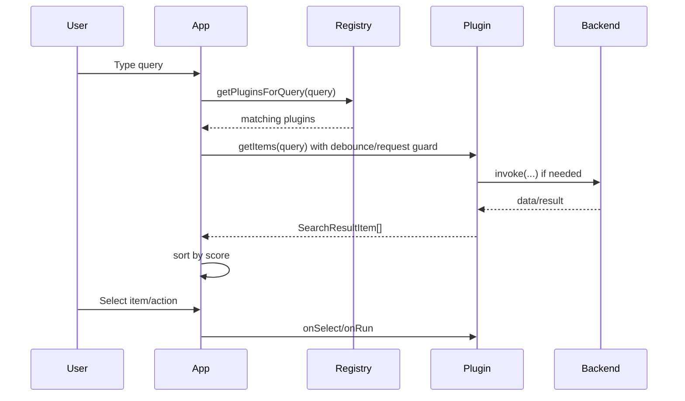
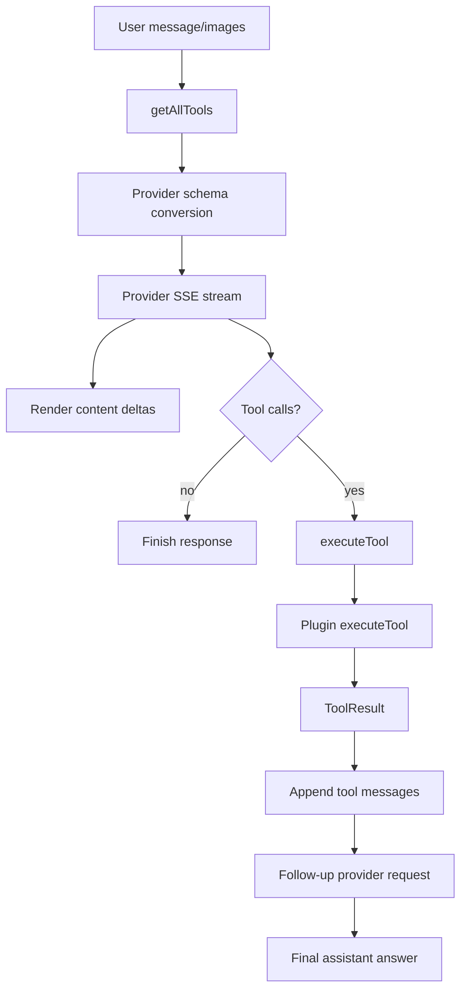
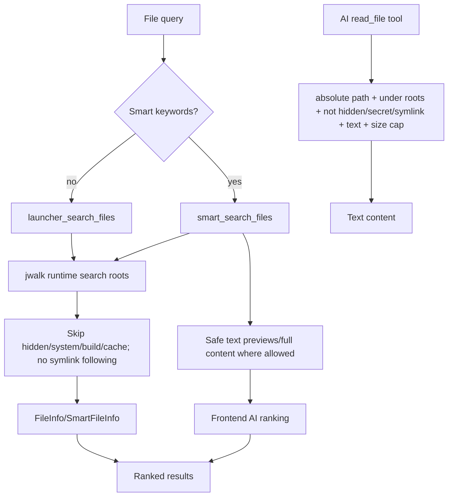
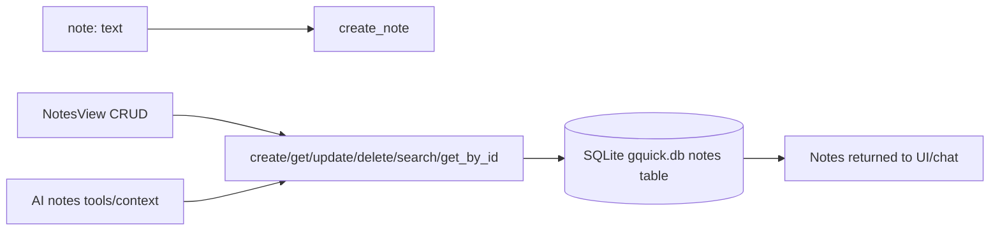
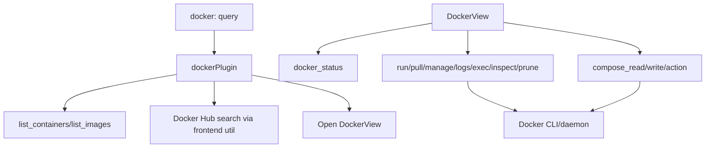
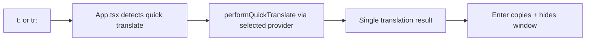

# Data Flows

## Search and actions

## AI chat with tool calling

## File search and safe read

## Notes persistence

## Docker management

## Screenshot/OCR

See `arch/backend-tauri.md` for detailed sequence. Key data outputs: saved Desktop PNG, clipboard image/text, or `ocr-image-ready` base64 event for frontend AI vision OCR.

## Quick translate

