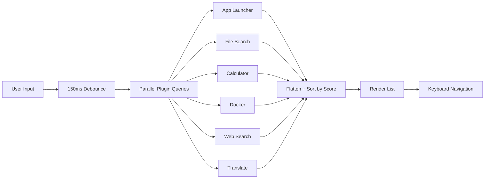
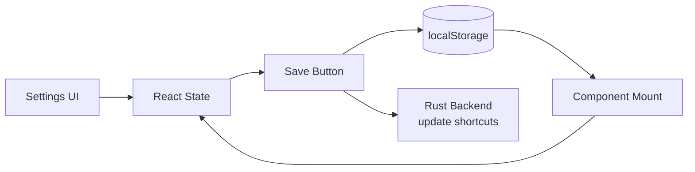
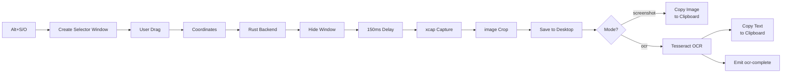
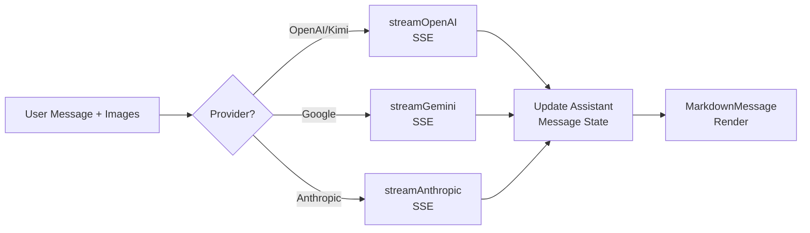

# Data Models and Schemas

## Frontend Types

### Plugin Types (`src/plugins/types.ts`)

```typescript
interface PluginAction {
  id: string;
  label: string;
  shortcut?: string;
  onRun: () => void;
}

interface PluginMetadata {
  id: string;
  title: string;
  subtitle?: string;
  icon: LucideIcon;
  keywords: string[];
}

interface SearchResultItem {
  id: string;
  pluginId: string;
  title: string;
  subtitle?: string;
  icon: LucideIcon | string | React.ReactNode;
  onSelect: () => void;
  actions?: PluginAction[];
  renderPreview?: () => React.ReactNode;
  score?: number;
}

interface GQuickPlugin {
  metadata: PluginMetadata;
  getItems: (query: string) => Promise<SearchResultItem[]>;
}
```

### Chat Types (`src/App.tsx`)

```typescript
interface ChatImage {
  dataUrl: string;
  mimeType: string;
  base64: string;
}

interface Message {
  id: string;
  role: "user" | "assistant";
  content: string;
  images?: ChatImage[];
}
```

### Translate Types (`src/utils/quickTranslate.ts`)

```typescript
interface QuickTranslateResult {
  result: string;
  detectedLang: string;
  targetLang: string;
  error?: string;
}
```

## Backend Types (Rust)

### App Info (`src-tauri/src/lib.rs`)

```rust
#[derive(serde::Serialize)]
struct AppInfo {
    name: String,
    path: String,
    icon: Option<String>,
}
```

### Docker Types (`src-tauri/src/lib.rs`)

```rust
#[derive(serde::Serialize)]
struct ContainerInfo {
    id: String,
    image: String,
    status: String,
    names: String,
}

#[derive(serde::Serialize)]
struct ImageInfo {
    id: String,
    repository: String,
    tag: String,
    size: String,
    created_since: String,
}
```

### File Types (`src-tauri/src/lib.rs`)

```rust
#[derive(serde::Serialize, Clone)]
struct FileInfo {
    name: String,
    path: String,
    is_dir: bool,
}

#[derive(serde::Serialize, Clone)]
struct SmartFileInfo {
    name: String,
    path: String,
    is_dir: bool,
    created: Option<String>,
    modified: Option<String>,
    size: u64,
    content_preview: Option<String>,
    full_content: Option<String>,
}
```

### Image Attachment (`src-tauri/src/lib.rs`)

```rust
#[derive(serde::Serialize)]
struct ImageAttachment {
    data_url: String,
    mime_type: String,
    base64: String,
}
```

## localStorage Schema

| Key | Type | Description |
|-----|------|-------------|
| `api-key` | `string` | Raw API key for AI provider |
| `api-provider` | `string` | Provider ID: `"openai"`, `"google"`, `"kimi"`, `"anthropic"` |
| `selected-model` | `string` | Selected model ID (e.g., `"gpt-4o"`) |
| `main-shortcut` | `string` | Global launcher shortcut (default: `"Alt+Space"`) |
| `screenshot-shortcut` | `string` | Screenshot shortcut (default: `"Alt+S"`) |
| `ocr-shortcut` | `string` | OCR shortcut (default: `"Alt+O"`) |
| `models-{provider}` | `string` | Cached model list with timestamp (24h TTL) |

**Removed keys** (no longer used):
- `ocr-model` — OCR model selection was removed (uses Tesseract locally)
- `auth-provider` — OAuth UI was removed

## Data Flow Diagrams

### Search Data Flow



### Settings Persistence Flow



### Screen Capture Data Flow



### AI Chat Data Flow



## File System Data

### Screenshot Save Path

```
macOS/Windows/Linux: ~/Desktop/gquick_capture.png
```

### App Discovery Paths

**macOS**:
```
/Applications
/System/Applications
```

**Windows**:
```
%ProgramData%\Microsoft\Windows\Start Menu\Programs
%APPDATA%\Microsoft\Windows\Start Menu\Programs
```

**Linux**:
```
/usr/share/applications
/usr/local/share/applications
~/.local/share/applications
```

### File Index Configuration

| Setting | Value |
|---------|-------|
| Root | User home directory |
| Max depth | 6 |
| Max files | 50,000 |
| Cache TTL | 5 minutes |
| Skip dirs | `node_modules`, `.git`, `target`, `build`, `dist`, `.cache`, `Caches`, `Trash`, etc. |

## SQLite Database

The app initializes `tauri-plugin-sql` with SQLite support, but **no tables or queries are defined yet**. The database connection is available but unused.

Potential future tables:
- `chat_history` — persisted chat messages
- `settings` — encrypted settings storage (replacement for localStorage)
- `app_usage` — usage analytics for better ranking
- `file_index` — persisted file index metadata
