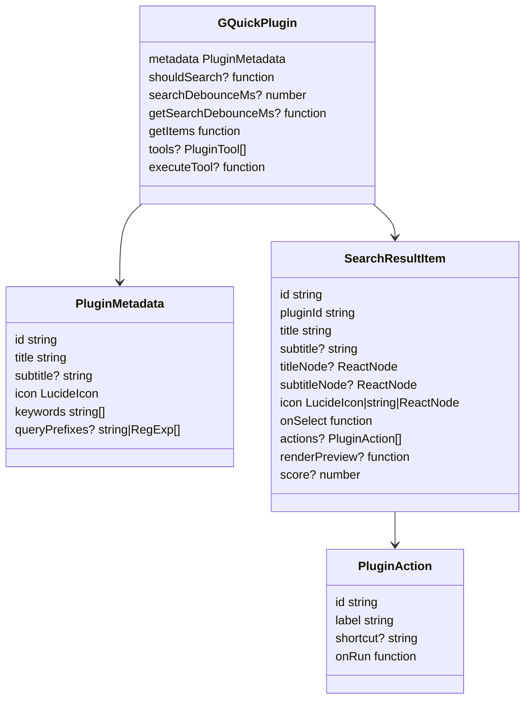
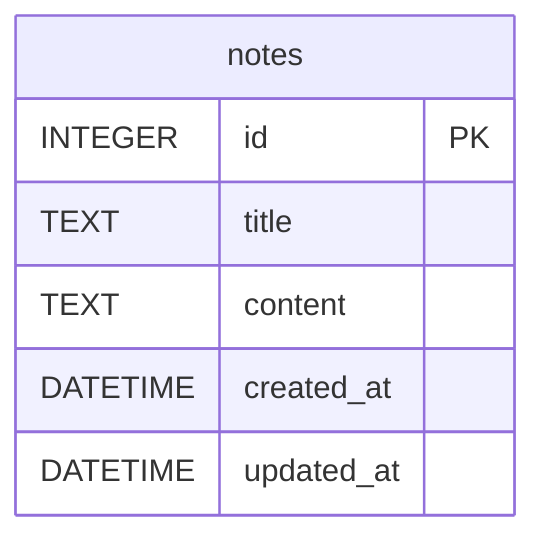

# Data Models

## Plugin and result models

See `src/plugins/types.ts`.



## AI chat models

`App.tsx` maintains local `Message` and `ChatImage` shapes:

```ts
interface ChatImage {
  dataUrl: string;
  mimeType: string;
  base64: string;
}

interface Message {
  id: string;
  role: "user" | "assistant" | "tool";
  content: string;
  images?: ChatImage[];
  toolCalls?: ToolCall[];
  toolCallId?: string;
}
```

## Notes database

SQLite database: app data directory `gquick.db`.



Rust/frontend note shape:

```ts
interface Note {
  id: number;
  title: string;
  content: string;
  created_at: string;
  updated_at: string;
}
```

## Backend DTOs

Important command DTOs returned by Rust:

- `AppInfo`: `{ name, path, icon? }`
- `FileInfo`: `{ name, path, is_dir }`
- `SmartFileInfo`: `{ name, path, is_dir, created?, modified?, size, content_preview?, full_content? }`
- `NetworkInfo`: `{ localIp, publicIp, ssid, latency }`
- `ContainerInfo`: `{ id, image, status, names, ports, state, created_at }`
- `ImageInfo`: `{ id, repository, tag, size, created_since }`
- `DockerStatus`: CLI installed, daemon running, Docker/Compose version fields, optional error fields.
- `DockerCommandResult`: `{ stdout, stderr }`
- `TerminalCommandResult`: `{ stdout, stderr, exit_code, canceled }`
- `ImageAttachment`: `{ data_url, mime_type, base64 }`

## Local storage settings

Frontend reads/writes API and feature settings in `localStorage`, including selected provider/model/API key, shortcut preferences from settings UI, saved weather location, and speedtest configuration.
