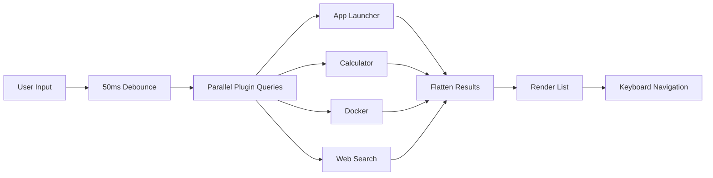
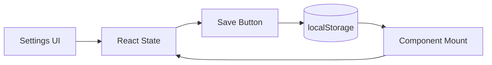
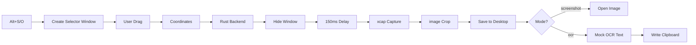

# Data Models and Schemas

## Frontend Types

### Plugin Types (`src/plugins/types.ts`)

```typescript
interface PluginAction {
  id: string;
  label: string;
  shortcut?: string;
  onRun: () => void;
}

interface PluginMetadata {
  id: string;
  title: string;
  subtitle?: string;
  icon: LucideIcon;
  keywords: string[];
}

interface SearchResultItem {
  id: string;
  pluginId: string;
  title: string;
  subtitle?: string;
  icon: LucideIcon | string | React.ReactNode;
  onSelect: () => void;
  actions?: PluginAction[];
  renderPreview?: () => React.ReactNode;
}

interface GQuickPlugin {
  metadata: PluginMetadata;
  getItems: (query: string) => Promise<SearchResultItem[]>;
}
```

### Chat Message Type (`src/App.tsx`)

```typescript
interface Message {
  id: string;
  role: "user" | "assistant";
  content: string;
}
```

## Backend Types (Rust)

### App Info (`src-tauri/src/lib.rs`)

```rust
#[derive(serde::Serialize)]
struct AppInfo {
    name: String,
    path: String,
    icon: Option<String>,
}
```

### Docker Types (`src-tauri/src/lib.rs`)

```rust
#[derive(serde::Serialize)]
struct ContainerInfo {
    id: String,
    image: String,
    status: String,
    names: String,
}

#[derive(serde::Serialize)]
struct ImageInfo {
    id: String,
    repository: String,
    tag: String,
    size: String,
    created_since: String,
}
```

## localStorage Schema

| Key | Type | Description |
|-----|------|-------------|
| `api-key` | `string` | Raw API key for AI provider |
| `api-provider` | `string` | Provider ID: `"openai"`, `"google"`, `"kimi"`, `"anthropic"` |
| `ocr-model` | `string` | Model ID: `"gpt-4o-mini"`, `"gpt-4o"`, `"gemini-2.0-flash"`, `"claude-3-5-sonnet"` |
| `auth-provider` | `string \| null` | Connected OAuth provider ID |

## Data Flow Diagrams

### Search Data Flow



### Settings Persistence Flow



### Screen Capture Data Flow



## File System Data

### Screenshot Save Path

```
macOS: ~/Desktop/gquick_capture.png
Other: ./gquick_capture.png (current directory)
```

### App Discovery Paths (macOS)

```
/Applications
/System/Applications
```

## SQLite Database

The app initializes `tauri-plugin-sql` with SQLite support, but **no tables or queries are defined yet**. The database connection is available but unused.

Potential future tables:
- `chat_history` — persisted chat messages
- `settings` — encrypted settings storage (replacement for localStorage)
- `app_usage` — usage analytics for better ranking
