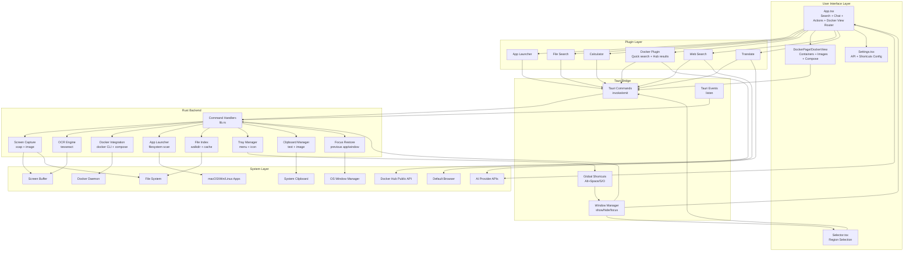
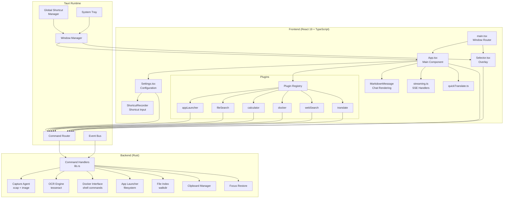
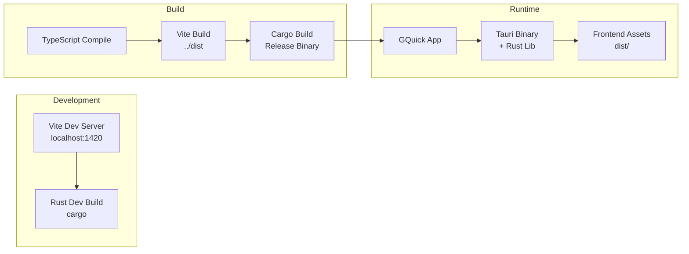
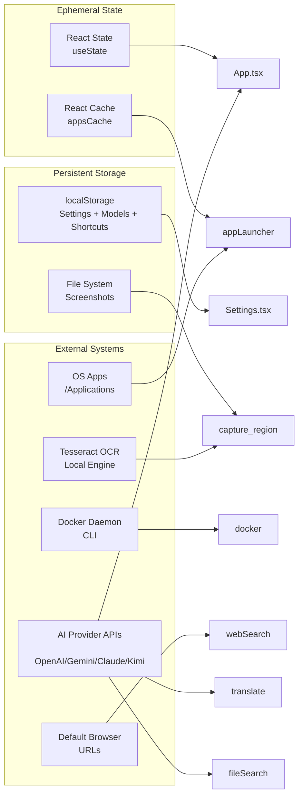

# System Architecture Diagram

```mermaid
graph TB
    subgraph "User Interface Layer"
        A[App.tsx
        Search + Chat + Actions + Docker View Router]
        DP[DockerPage/DockerView
        Containers + Images + Compose]
        S[Selector.tsx
        Region Selection]
        ST[Settings.tsx
        API + Shortcuts Config]
    end

    subgraph "Plugin Layer"
        P1[App Launcher]
        P2[File Search]
        P3[Calculator]
        P4[Docker Plugin
        Quick search + Hub results]
        P5[Web Search]
        P6[Translate]
    end

    subgraph "Tauri Bridge"
        TC[Tauri Commands
        invoke/emit]
        TE[Tauri Events
        listen]
        GS[Global Shortcuts
        Alt+Space/S/O]
        WM[Window Manager
        show/hide/focus]
    end

    subgraph "Rust Backend"
        RC[Command Handlers
        lib.rs]
        SC[Screen Capture
        xcap + image]
        OC[OCR Engine
        tesseract]
        DC[Docker Integration
        docker CLI + compose]
        AC[App Launcher
        filesystem scan]
        FI[File Index
        walkdir + cache]
        TR[Tray Manager
        menu + icon]
        CL[Clipboard Manager
        text + image]
        FR[Focus Restore
        previous app/window]
    end

    subgraph "System Layer"
        SYS1[macOS/Win/Linux Apps]
        SYS2[Docker Daemon]
        SYS3[Screen Buffer]
        SYS4[File System]
        SYS5[System Clipboard]
        SYS6[Default Browser]
        SYS7[AI Provider APIs]
        SYS8[Docker Hub Public API]
        SYS9[OS Window Manager]
    end

    A --> P1
    A --> P2
    A --> P3
    A --> P4
    A --> DP
    A --> P5
    A --> P6
    A --> ST
    S --> TC

    P1 --> TC
    P2 --> TC
    P3 --> TC
    P4 --> TC
    P4 --> SYS8
    DP --> TC
    P5 --> TC
    P6 --> TC
    P6 --> SYS7
    A --> SYS7

    TC --> RC
    TE --> RC
    GS --> WM
    WM --> RC

    RC --> SC
    RC --> OC
    RC --> DC
    RC --> AC
    RC --> FI
    RC --> TR
    RC --> CL
    RC --> FR

    SC --> SYS3
    SC --> SYS4
    OC --> SYS3
    DC --> SYS2
    AC --> SYS1
    CL --> SYS5
    P5 --> SYS6
    FI --> SYS4
    FR --> SYS9

    TR --> GS
    WM --> A
    WM --> S
```

## Component Diagram

```mermaid
graph TB
    subgraph "Frontend (React 19 + TypeScript)"
        direction TB
        M[main.tsx
        Window Router]
        A[App.tsx
        Main Component]
        Se[Selector.tsx
        Overlay]
        St[Settings.tsx
        Configuration]
        MM[MarkdownMessage
        Chat Rendering]
        SR[ShortcutRecorder
        Shortcut Input]
        QT[quickTranslate.ts]
        Stream[streaming.ts
        SSE Handlers]

        subgraph "Plugins"
            PL[Plugin Registry]
            P1[appLauncher]
            P2[fileSearch]
            P3[calculator]
            P4[docker]
            P5[webSearch]
            P6[translate]
        end
    end

    subgraph "Tauri Runtime"
        direction TB
        TC[Command Router]
        TE[Event Bus]
        GS[Global Shortcut
        Manager]
        WM[Window Manager]
        TR[System Tray]
    end

    subgraph "Backend (Rust)"
        direction TB
        CH[Command Handlers
        lib.rs]
        CA[Capture Agent
        xcap + image]
        OC[OCR Engine
        tesseract]
        DI[Docker Interface
        shell commands]
        AL[App Launcher
        filesystem]
        FI[File Index
        walkdir]
        CM[Clipboard Manager]
        FR[Focus Restore]
    end

    M --> A
    M --> Se
    A --> St
    A --> PL
    A --> MM
    A --> Stream
    A --> QT
    St --> SR
    PL --> P1
    PL --> P2
    PL --> P3
    PL --> P4
    PL --> P5
    PL --> P6

    A --> TC
    Se --> TC
    St --> TC
    P1 --> TC
    P2 --> TC
    P3 --> TC
    P4 --> TC
    P5 --> TC
    P6 --> TC

    TC --> CH
    TE --> CH
    GS --> WM
    WM --> A
    WM --> Se
    TR --> WM

    CH --> CA
    CH --> OC
    CH --> DI
    CH --> AL
    CH --> FI
    CH --> CM
    CH --> FR
```

## Deployment Architecture

```mermaid
graph LR
    subgraph "Development"
        Vite[Vite Dev Server
        localhost:1420]
        Rust[Rust Dev Build
        cargo]
        Vite --> Rust
    end

    subgraph "Build"
        TS[TypeScript Compile]
        ViteBuild[Vite Build
        ../dist]
        CargoBuild[Cargo Build
        Release Binary]
        TS --> ViteBuild
        ViteBuild --> CargoBuild
    end

    subgraph "Runtime"
        App[GQuick App]
        Binary[Tauri Binary
        + Rust Lib]
        Frontend[Frontend Assets
        dist/]
        Binary --> Frontend
        App --> Binary
    end

    CargoBuild --> App
```

## Data Architecture

```mermaid
graph LR
    subgraph "Ephemeral State"
        RS[React State
        useState]
        RC[React Cache
        appsCache]
    end

    subgraph "Persistent Storage"
        LS[localStorage
        Settings + Models + Shortcuts]
        FS[File System
        Screenshots]
    end

    subgraph "External Systems"
        Docker[Docker Daemon
        CLI]
        OS[OS Apps
        /Applications]
        Browser[Default Browser
        URLs]
        AI[AI Provider APIs
        OpenAI/Gemini/Claude/Kimi]
        OCR[Tesseract OCR
        Local Engine]
    end

    RS --> A[App.tsx]
    RC --> P1[appLauncher]
    LS --> St[Settings.tsx]
    FS --> CA[capture_region]
    Docker --> P4[docker]
    OS --> P1
    Browser --> P5[webSearch]
    AI --> A
    AI --> P6[translate]
    AI --> P2[fileSearch]
    OCR --> CA
```
