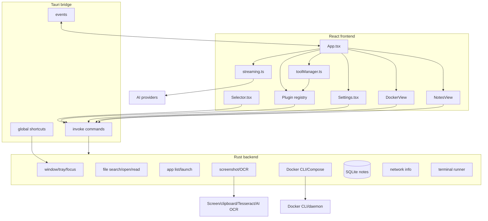

# Architecture Diagrams

## Overall architecture

```mermaid
graph TB
  subgraph UI[React frontend]
    Main[App.tsx]
    Selector[Selector.tsx]
    Settings[Settings.tsx]
    Plugins[Plugin registry]
    Tools[toolManager.ts]
    Streaming[streaming.ts]
    DockerView[DockerView]
    NotesView[NotesView]
  end

  subgraph Tauri[Tauri bridge]
    Invoke[invoke commands]
    Events[events]
    Shortcuts[global shortcuts]
  end

  subgraph Rust[Rust backend]
    Window[window/tray/focus]
    Files[file search/open/read]
    Apps[app list/launch]
    Capture[screenshot/OCR]
    Docker[Docker CLI/Compose]
    Notes[(SQLite notes)]
    Network[network info]
    Terminal[terminal runner]
  end

  Main --> Plugins
  Main --> Tools
  Main --> Streaming
  Main --> Settings
  Main --> DockerView
  Main --> NotesView
  Selector --> Invoke
  Plugins --> Invoke
  Settings --> Invoke
  DockerView --> Invoke
  NotesView --> Invoke
  Invoke --> Rust
  Shortcuts --> Window
  Events <--> Main
  Tools --> Plugins
  Streaming --> AI[AI providers]
  Docker --> DockerCLI[Docker CLI/daemon]
  Capture --> Screen[Screen/clipboard/Tesseract/AI OCR]
```
