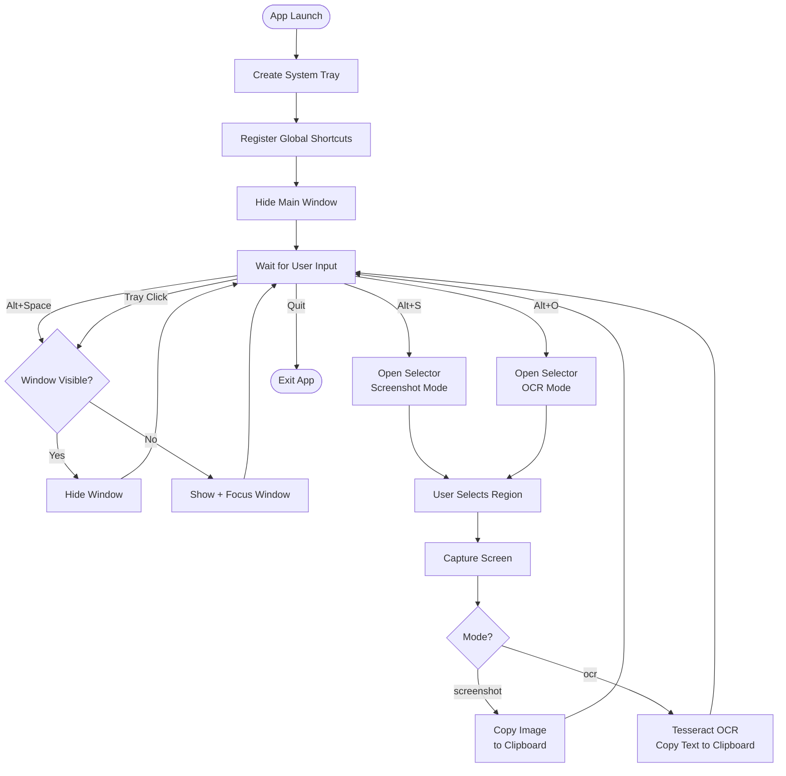
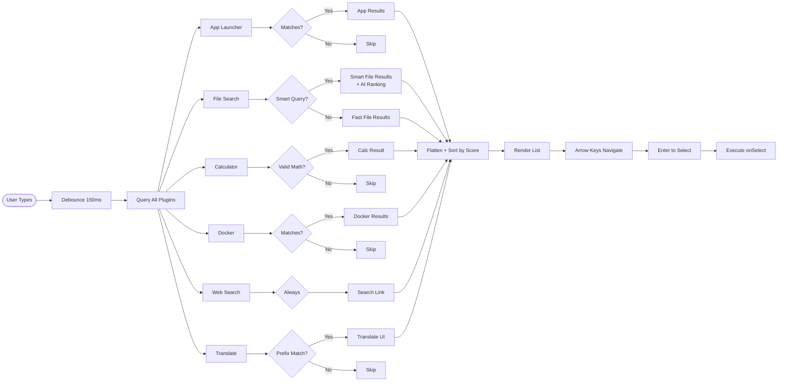
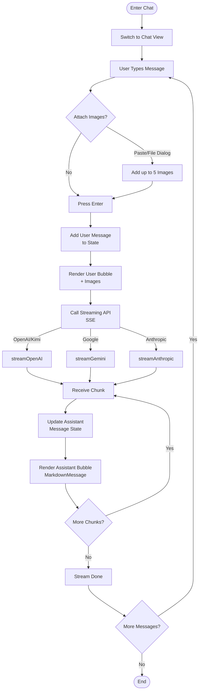
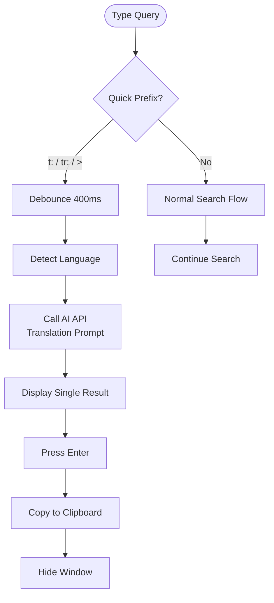
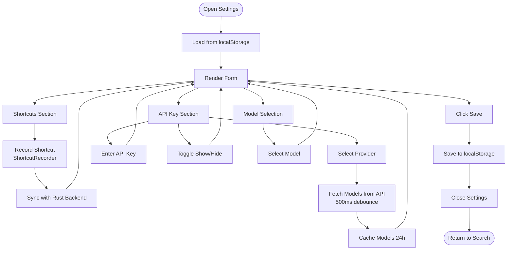
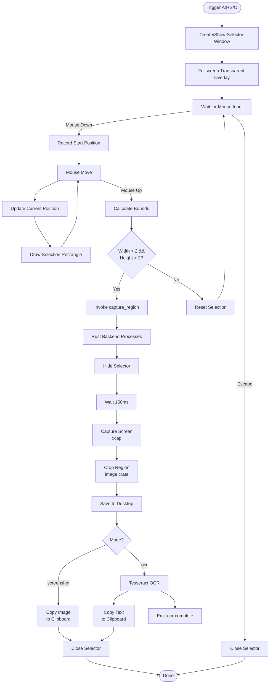
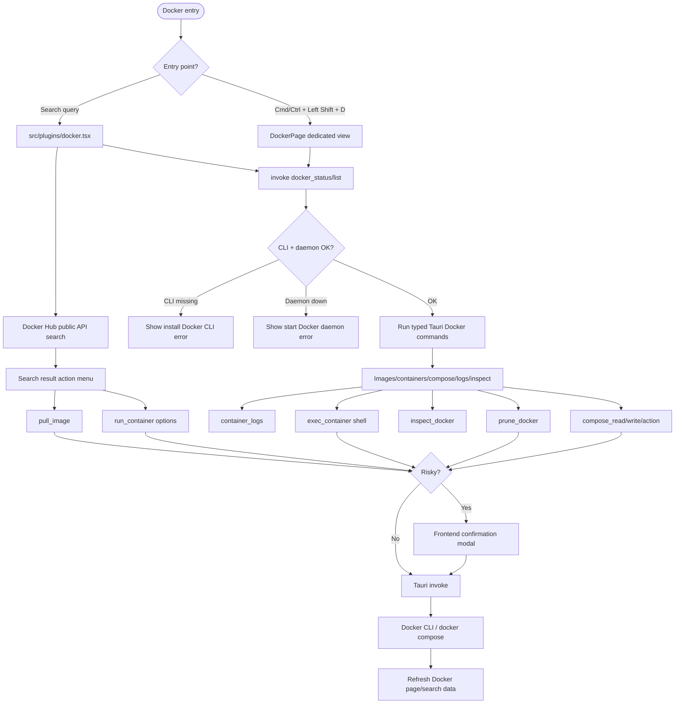

# Business Flow Diagrams

## Main Application Flow



## Search Flow



## Chat Flow (Real AI Streaming)



## Quick Translate Flow



## Settings Configuration Flow



## Region Selection Flow



## Docker Management Flow (Target)



## Smart File Search Flow

```mermaid
flowchart TD
    Start([Type Smart Query]) --> Detect{Contains Keywords?}
    Detect -->|Yes| Smart[Call smart_search_files]
    Detect -->|No| Fast[Call search_files]

    Fast --> Index1[Use Cached File Index]
    Index1 --> Score1[Keyword Scoring]
    Score1 --> Top50[Return Top 50]
    Top50 --> RenderFast[Render Results]

    Smart --> Index2[Build/Refresh File Index]
    Index2 --> Metadata[Read Metadata
    created/modified/size]
    Metadata --> Content[Read Text Content
    up to 100KB]
    Content --> Filter[Apply Time Filters
    if specified]
    Filter --> Candidates[Return up to 100 Candidates]
    Candidates --> AI[Call AI API
    Rank by Relevance]
    AI --> Reorder[Reorder by AI Ranking]
    Reorder --> RenderSmart[Render with "Smart" Badge]
```
