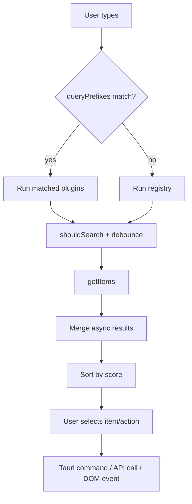
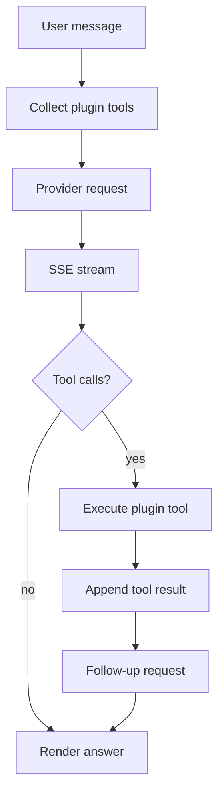
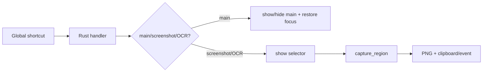

# Flow Diagrams

## Launcher query flow

```mermaid
flowchart TD
  Start[User types] --> Prefix{queryPrefixes match?}
  Prefix -->|yes| Target[Run matched plugins]
  Prefix -->|no| Registry[Run registry]
  Target --> Filter[shouldSearch + debounce]
  Registry --> Filter
  Filter --> Items[getItems]
  Items --> Merge[Merge async results]
  Merge --> Sort[Sort by score]
  Sort --> Select[User selects item/action]
  Select --> Effect[Tauri command / API call / DOM event]
```

## AI tool loop

```mermaid
flowchart TD
  UserMsg[User message] --> Tools[Collect plugin tools]
  Tools --> Request[Provider request]
  Request --> Stream[SSE stream]
  Stream --> Calls{Tool calls?}
  Calls -->|no| Answer[Render answer]
  Calls -->|yes| Exec[Execute plugin tool]
  Exec --> ToolResult[Append tool result]
  ToolResult --> Request2[Follow-up request]
  Request2 --> Answer
```

## Window/capture flow

```mermaid
flowchart LR
  Shortcut[Global shortcut] --> Rust[Rust handler]
  Rust --> Main{main/screenshot/OCR?}
  Main -->|main| Toggle[show/hide main + restore focus]
  Main -->|screenshot/OCR| Selector[show selector]
  Selector --> Capture[capture_region]
  Capture --> Output[PNG + clipboard/event]
```
