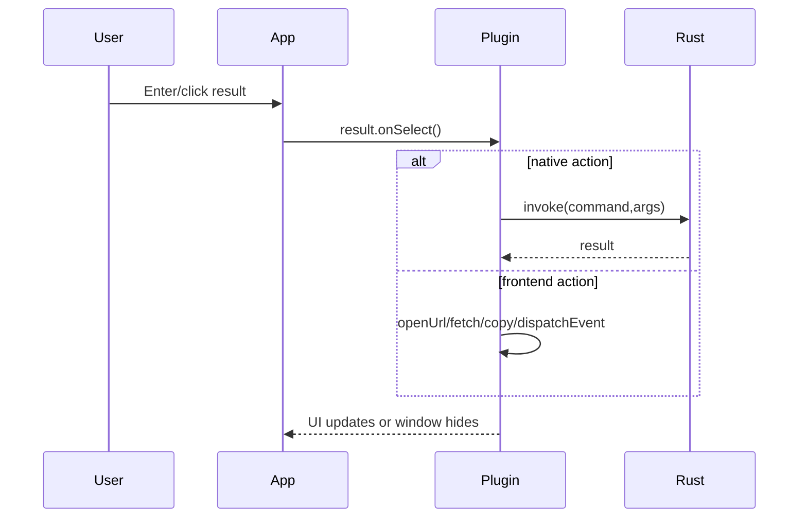
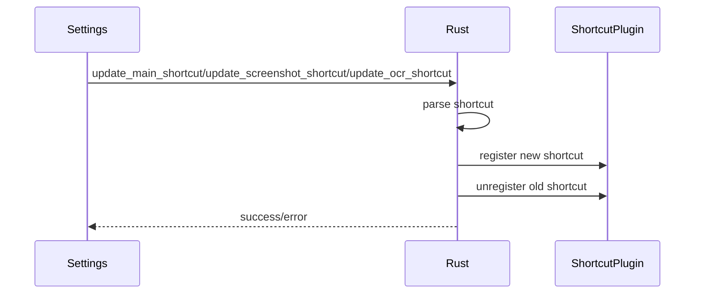

# Sequence Diagrams

See also `arch/api/sequences.md`.

## Search result selection

```mermaid
sequenceDiagram
  participant User
  participant App
  participant Plugin
  participant Rust

  User->>App: Enter/click result
  App->>Plugin: result.onSelect()
  alt native action
    Plugin->>Rust: invoke(command,args)
    Rust-->>Plugin: result
  else frontend action
    Plugin->>Plugin: openUrl/fetch/copy/dispatchEvent
  end
  Plugin-->>App: UI updates or window hides
```

## Settings shortcut update

```mermaid
sequenceDiagram
  participant Settings
  participant Rust
  participant ShortcutPlugin

  Settings->>Rust: update_main_shortcut/update_screenshot_shortcut/update_ocr_shortcut
  Rust->>Rust: parse shortcut
  Rust->>ShortcutPlugin: register new shortcut
  Rust->>ShortcutPlugin: unregister old shortcut
  Rust-->>Settings: success/error
```
