# Sequence Diagrams

## Application Startup

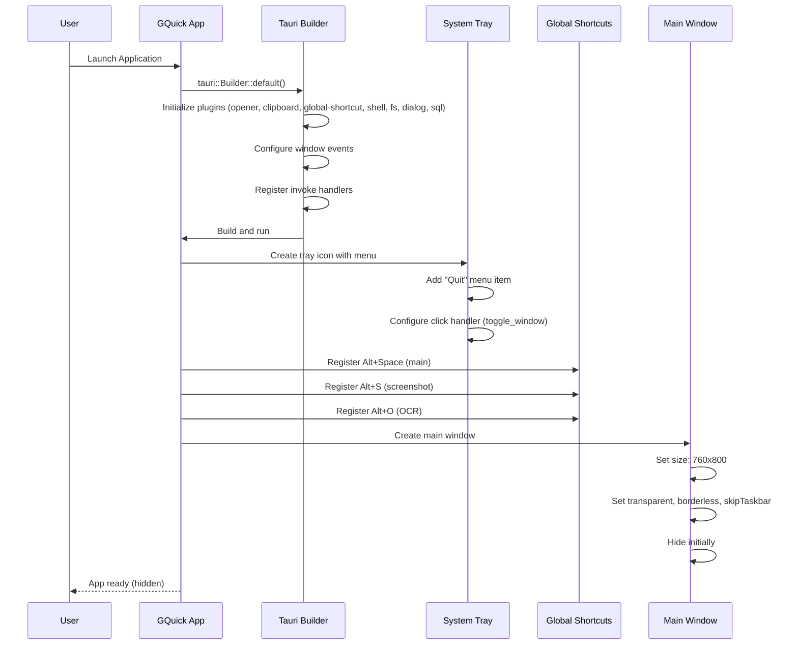

## Search and Launch

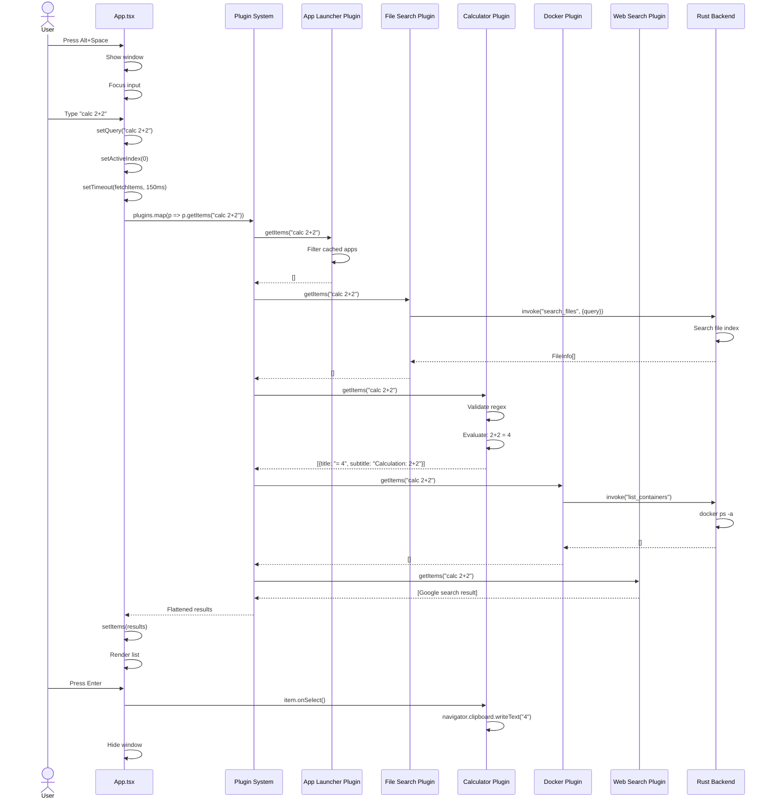

## Smart File Search

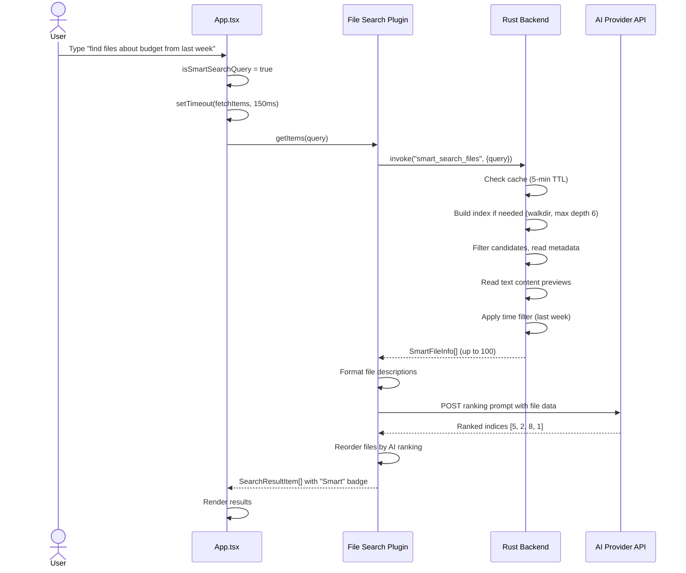

## Screenshot Capture

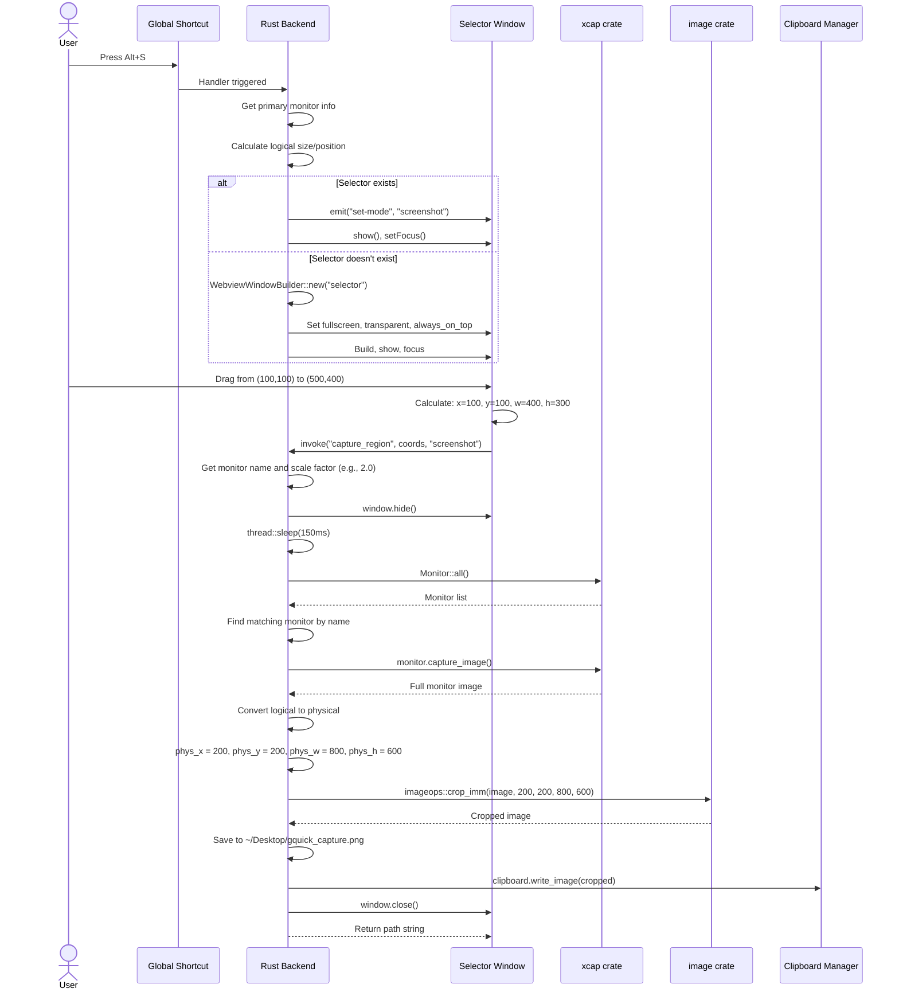

## OCR Flow (Real Tesseract Implementation)

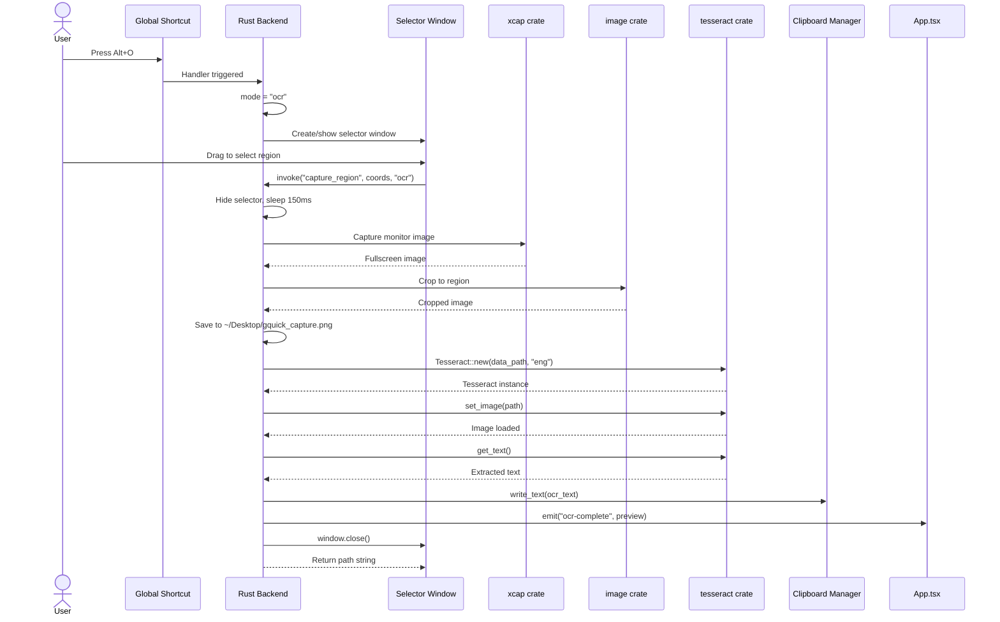

## AI Chat Flow (Real Streaming)

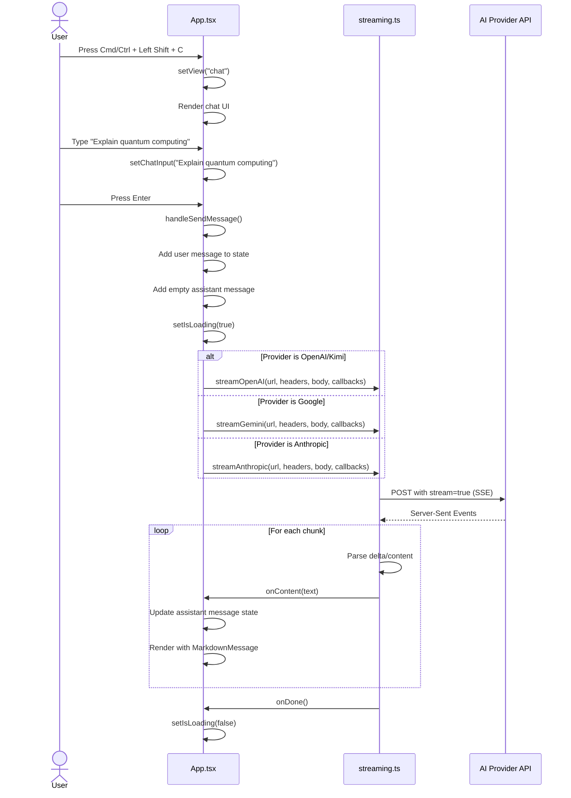

## Settings Configuration

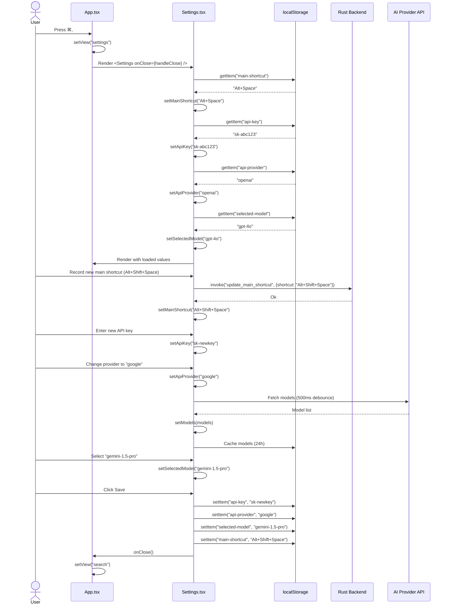

## Docker Container Management

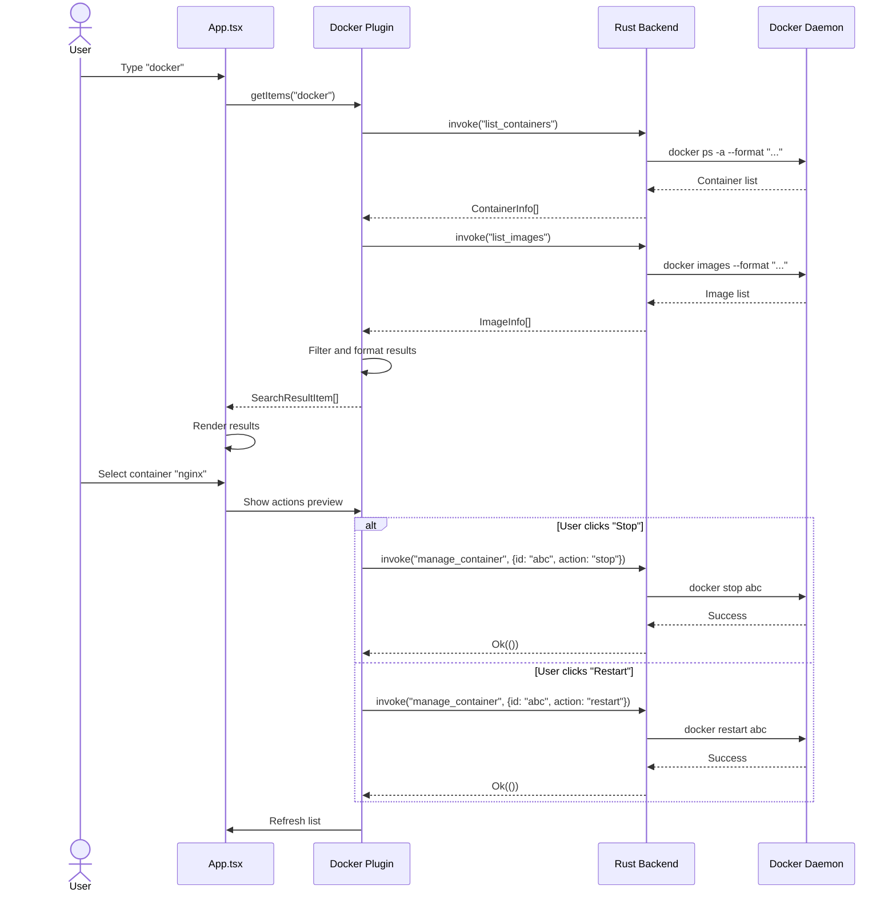

## Quick Translate

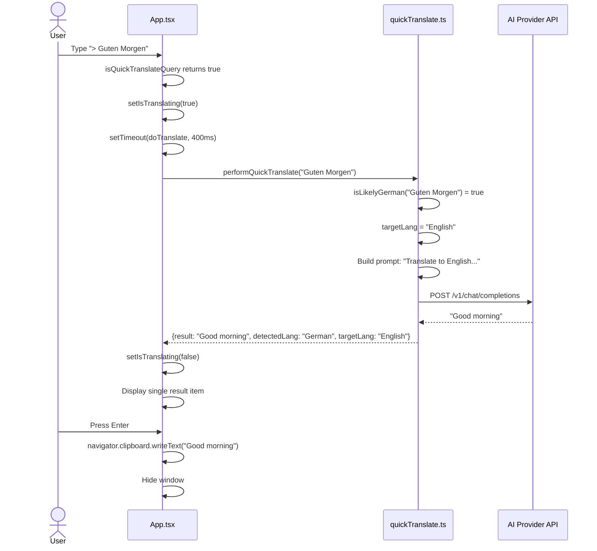

## Global Shortcut Registration Sequence

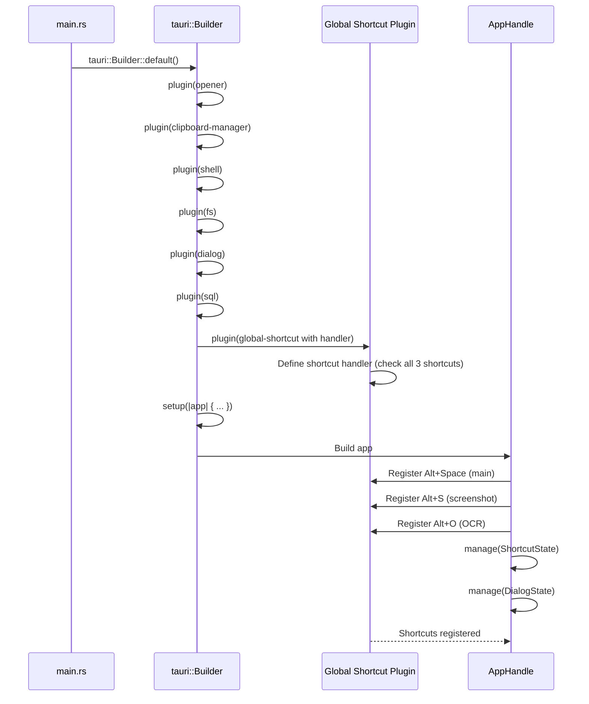

## Window Toggle Sequence

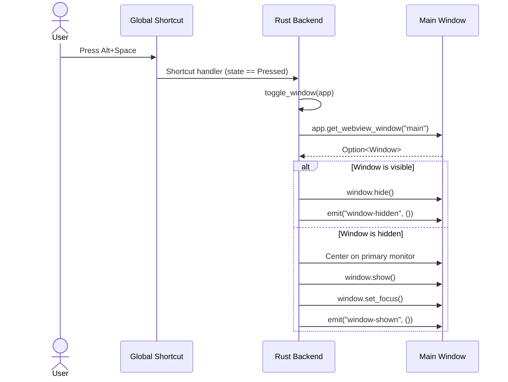
