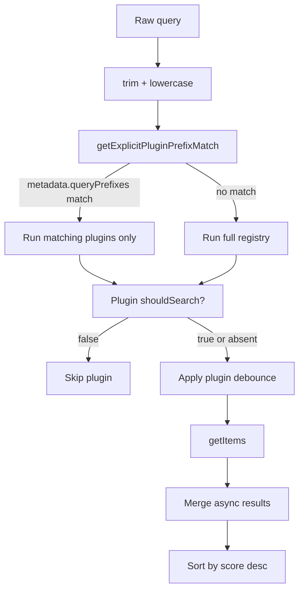

# Plugin Registry, Interface, and Lifecycle

Source of truth: `src/plugins/types.ts`, `src/plugins/index.ts`, `src/App.tsx`.

## Interface

Each plugin implements `GQuickPlugin`:

```ts
interface GQuickPlugin {
  metadata: PluginMetadata;
  shouldSearch?: (query: string) => boolean;
  searchDebounceMs?: number;
  getSearchDebounceMs?: (query: string) => number | undefined;
  getItems: (query: string) => Promise<SearchResultItem[]>;
  tools?: PluginTool[];
  executeTool?: (name: string, args: Record<string, any>) => Promise<ToolResult>;
}
```

`SearchResultItem` carries display fields, optional live React nodes, icon, score, selection handler, optional secondary actions, and optional `renderPreview()` UI.

## Registry

`src/plugins/index.ts` exports ordered plugin list:

1. `appLauncherPlugin`
2. `recentFilesPlugin`
3. `fileSearchPlugin`
4. `calculatorPlugin`
5. `dockerPlugin`
6. `webSearchPlugin`
7. `translatePlugin`
8. `notesPlugin`
9. `networkInfoPlugin`
10. `speedtestPlugin`
11. `weatherPlugin`

## Routing



String prefixes are case-insensitive `startsWith`; regexp prefixes run against the trimmed query.

## Lifecycle

1. User enters query in `App.tsx` search view.
2. `getPluginsForQuery(query)` returns matching plugins or full registry.
3. `App.tsx` splits plugins into **immediate** (no `searchDebounceMs` / `getSearchDebounceMs` configured) and **debounced** groups.
4. Immediate plugins run silently without triggering the searching indicator.
5. Debounced plugins run after their configured delay and do trigger the searching indicator / status text.
6. Results from both groups are merged and **deduplicated by `id`** (first occurrence wins, so immediate results take priority over debounced ones).
7. Final results are flattened and sorted by `score` descending.
8. Selection runs `onSelect`; secondary action overlay can run item `actions`.
9. Plugin code may call Tauri commands via `invoke`, browser/HTTP APIs, local storage, clipboard APIs, or dispatch custom DOM events consumed by `App.tsx`.

## Event conventions

- `gquick-open-notes`, `gquick-open-note`, `gquick-note-saved` — notes view navigation/state refresh.
- `gquick-open-docker` — opens Docker view, optionally with an initial image context.
- `window-shown`, `window-hidden`, `open-settings`, `terminal-close-requested` — emitted from Rust to frontend for window lifecycle.
- `ocr-complete`, `ocr-image-ready`, `ocr-error` — screenshot/OCR completion signals.

## Extension checklist

- Add plugin file under `src/plugins/`.
- Export it from `src/plugins/index.ts` registry in desired priority order.
- Define explicit `queryPrefixes` if plugin is opt-in or expensive.
- Use `shouldSearch` to avoid unnecessary API/CLI work.
- Return scores consistently; higher appears first.
- If exposing AI tools, add `tools` and `executeTool` and document in `arch/plugin-tools.md`.
