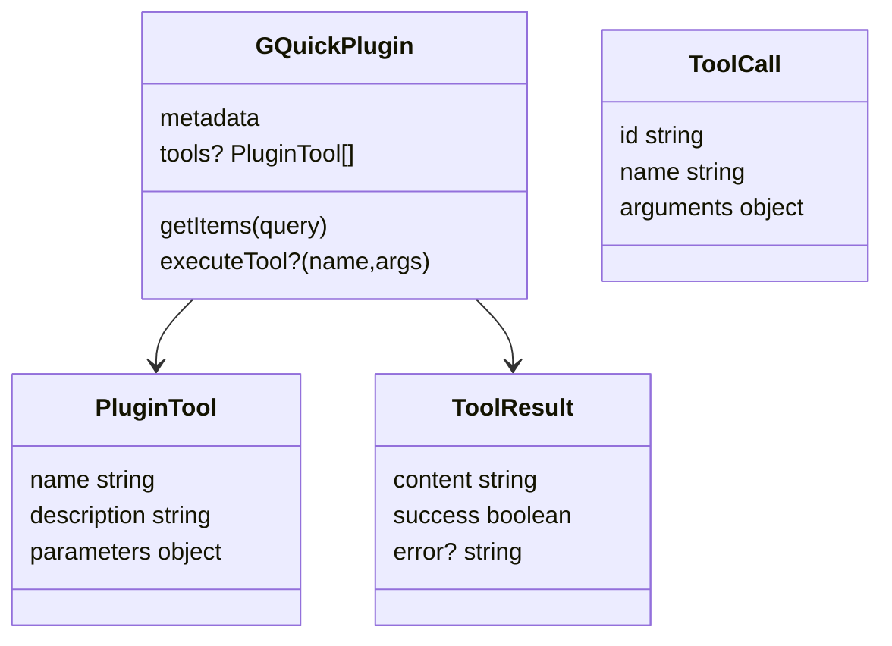
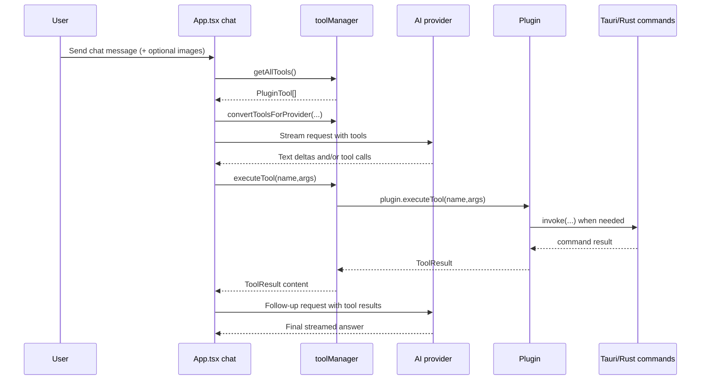

# Plugin Tools and AI Tool Calling

Source of truth: `src/plugins/types.ts`, `src/utils/toolManager.ts`, `src/utils/streaming.ts`, `src/App.tsx`.

Plugin tools let selected plugins expose structured functions to AI chat. `App.tsx` collects tools with `getAllTools()`, converts schemas to provider-specific format, streams model output, executes requested tools through `executeTool()`, appends tool results to message history, and sends a follow-up request for the final answer.

## Current tool inventory

| Plugin | Tools | Backing implementation |
|---|---|---|
| Calculator | `calculate` | Frontend expression parser |
| Files & Folders | `search_files`, `read_file` | Rust `search_files` and `read_file` with safe-read policy |
| Notes | `search_notes`, `create_note` | Rust SQLite commands |
| Network info | `get_network_info` | Rust network command with frontend cache wrapper |
| Weather | `get_current_weather`, `get_weather_forecast` | Frontend Open-Meteo geocoding/weather fetch |

Not currently exposed as plugin AI tools: Docker, Web Search, Applications, Translate, Speedtest. OpenAI hosted web search is separate from plugin tools and is conditionally enabled for supported OpenAI Responses models in `App.tsx`.

## Tool schema

## Provider conversion

`src/utils/toolManager.ts` converts the common `PluginTool` shape into each provider format:

- OpenAI/Kimi Chat Completions: `{ type: "function", function: { name, description, parameters } }`
- OpenAI Responses: `{ type: "function", name, description, parameters }`
- Gemini: `{ functionDeclarations: [...] }`
- Anthropic: `{ name, description, input_schema }`

It also converts chat history containing `assistant.toolCalls` and `tool` result messages back into each provider's expected message format.

## Tool call sequence

## Streaming behavior

- `streamOpenAITools` accumulates `delta.tool_calls` from Chat Completions SSE chunks.
- `streamOpenAIResponsesTools` handles `response.output_item.done` function calls and URL citation annotations.
- `streamGeminiTools` reads `functionCall` parts from streamed candidates and de-duplicates identical calls.
- `streamAnthropicTools` accumulates `tool_use` blocks and `input_json_delta` fragments.

## Safety notes

- `executeTool()` returns a normalized failure result for missing tools and catches thrown errors.
- File reading is constrained by Rust-side validation; frontend tool args cannot bypass the safe-read policy.
- Tool results are plain text/JSON strings and are inserted into the model conversation as provider-specific tool result messages.
