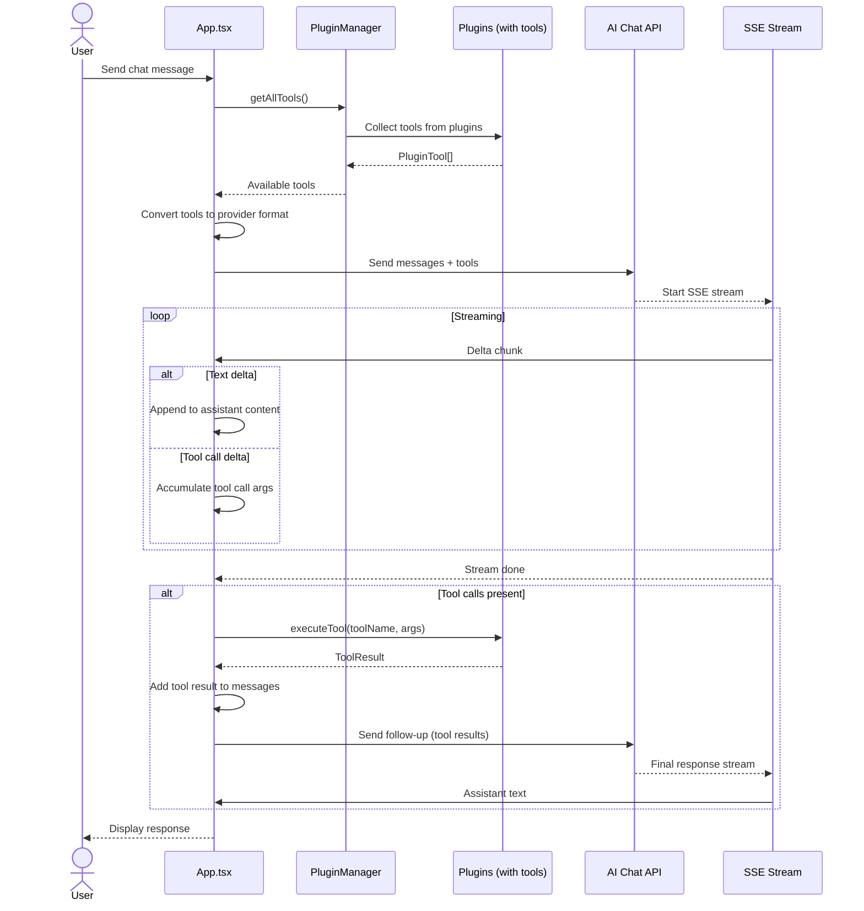
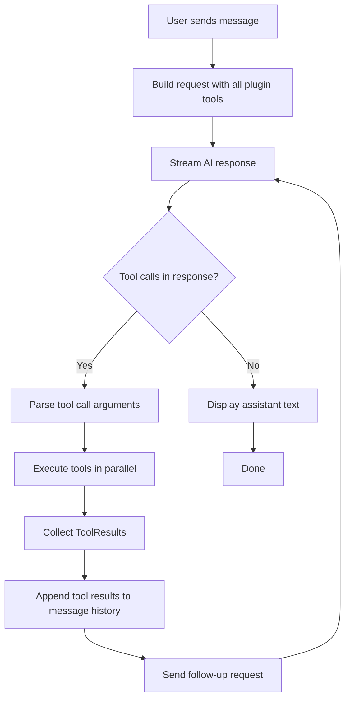

# Plugin-Tools for AI Chat

## Overview

GQuick plugins can optionally expose **tools** — structured functions that the AI can invoke during chat conversations. This enables the AI to perform real-world actions through plugins: search files, run calculations, query Docker status, save notes, launch applications, and more.

**Core principle**: AI always receives all available tools in context. The model decides which tool(s) to use (or none). Tool results feed back into the conversation as new messages, allowing multi-turn tool use.

---

## Tool Call Flow



---

## Interface Definitions

### Plugin Tool Types

Added to `src/plugins/types.ts`:

```typescript
/**
 * JSON Schema type for tool parameters (subset for our use cases).
 * Uses simple definitions compatible with all provider tool schemas.
 */
export type ToolParameterType = "string" | "number" | "boolean" | "integer" | "array" | "object";

export interface ToolParameter {
  type: ToolParameterType;
  description?: string;
  enum?: (string | number)[];
  items?: ToolParameter; // for array type
  properties?: Record<string, ToolParameter>; // for object type
  required?: string[];
}

export interface PluginTool {
  /** Unique tool name (globally unique across all plugins) */
  name: string;
  /** Human-readable description for the AI model */
  description: string;
  /** JSON Schema for the tool's parameters */
  parameters: {
    type: "object";
    properties: Record<string, ToolParameter>;
    required?: string[];
  };
  /** Whether this tool returns a stream (e.g. shell command output) */
  isStreaming?: boolean;
}

export interface ToolResult {
  /** Tool output as string (JSON-encoded if structured) */
  content: string;
  /** Whether the tool execution succeeded */
  success: boolean;
  /** Optional error message if success is false */
  error?: string;
}

export interface GQuickPlugin {
  metadata: PluginMetadata;
  searchDebounceMs?: number;
  getItems: (query: string) => Promise<SearchResultItem[]>;
  /** Optional: tools this plugin exposes to the AI chat */
  tools?: PluginTool[];
  /** Optional: execute a tool by name. Required if tools is provided. */
  executeTool?: (name: string, args: Record<string, unknown>) => Promise<ToolResult>;
}
```

### Tool Execution Manager

New file `src/plugins/toolManager.ts`:

```typescript
import { plugins } from "./index";
import { PluginTool, ToolResult } from "./types";

export function getAllTools(): PluginTool[] {
  return plugins.flatMap(p => p.tools ?? []);
}

export async function executeTool(
  name: string,
  args: Record<string, unknown>
): Promise<ToolResult> {
  const plugin = plugins.find(p => p.tools?.some(t => t.name === name));
  if (!plugin || !plugin.executeTool) {
    return { content: "", success: false, error: `Tool "${name}" not found` };
  }
  try {
    return await plugin.executeTool(name, args);
  } catch (err: any) {
    return { content: "", success: false, error: err.message || String(err) };
  }
}
```

---

## Provider-Specific Tool Format Mapping

### OpenAI / Kimi (Shared Format)

Both providers use the OpenAI-compatible function-calling schema.

**Request — Tool Declaration:**

```typescript
interface OpenAITool {
  type: "function";
  function: {
    name: string;
    description: string;
    parameters: {
      type: "object";
      properties: Record<string, any>;
      required?: string[];
    };
  };
}
```

**Conversion from `PluginTool`:**

```typescript
function toOpenAITool(tool: PluginTool): OpenAITool {
  return {
    type: "function",
    function: {
      name: tool.name,
      description: tool.description,
      parameters: tool.parameters,
    },
  };
}
```

**Request Body:**

```json
{
  "model": "gpt-4o",
  "messages": [...],
  "tools": [{ "type": "function", "function": { ... } }],
  "tool_choice": "auto",
  "stream": true
}
```

**Streaming Response — Tool Call Deltas:**

Tool calls arrive incrementally across multiple SSE chunks:

```json
// Chunk 1: tool call starts
{"choices":[{"delta":{"tool_calls":[{"index":0,"id":"call_abc","type":"function","function":{"name":"search_files","arguments":""}}]}}]}

// Chunk 2-N: arguments stream as partial JSON
{"choices":[{"delta":{"tool_calls":[{"index":0,"function":{"arguments":"{\"query\":\"budget"}}]}}]}

// Chunk N+1: arguments complete
{"choices":[{"delta":{"tool_calls":[{"index":0,"function":{"arguments":"ng\"}"}}]}}]}
```

**Accumulator Logic:**

```typescript
// Map index -> accumulated tool call
const toolCallAcc = new Map<number, { id: string; name: string; args: string }>();

// In stream handler:
const toolCalls = delta.tool_calls;
for (const tc of toolCalls) {
  const acc = toolCallAcc.get(tc.index) ?? { id: tc.id ?? "", name: "", args: "" };
  if (tc.id) acc.id = tc.id;
  if (tc.function?.name) acc.name += tc.function.name;
  if (tc.function?.arguments) acc.args += tc.function.arguments;
  toolCallAcc.set(tc.index, acc);
}
```

After stream ends, parse `acc.args` with `JSON.parse()` for each completed tool call.

**Result Message Format:**

```typescript
{
  role: "tool",
  tool_call_id: "call_abc",
  content: JSON.stringify(result.content)
}
```

---

### Google Gemini

Gemini uses a flat `tools` array with `functionDeclarations`.

**Request — Tool Declaration:**

```typescript
interface GeminiTool {
  functionDeclarations: {
    name: string;
    description: string;
    parameters: {
      type: "object";
      properties: Record<string, any>;
      required?: string[];
    };
  }[];
}
```

**Conversion from `PluginTool`:**

```typescript
function toGeminiTool(tools: PluginTool[]): GeminiTool {
  return {
    functionDeclarations: tools.map(t => ({
      name: t.name,
      description: t.description,
      parameters: t.parameters,
    })),
  };
}
```

**Request Body:**

```json
{
  "tools": [{ "functionDeclarations": [{ "name": "search_files", ... }] }],
  "toolConfig": { "functionCallingConfig": { "mode": "AUTO" } },
  "contents": [...]
}
```

**Streaming Response — Tool Call Detection:**

Gemini does **not** stream tool call arguments incrementally in the same way. Tool calls typically appear as a complete `functionCall` part in a single chunk (or the candidate's first chunk):

```json
{
  "candidates": [{
    "content": {
      "role": "model",
      "parts": [{
        "functionCall": {
          "name": "search_files",
          "args": { "query": "budgeting" }
        }
      }]
    }
  }]
}
```

If the model returns a `functionCall` part, the stream stops. The client must:
1. Execute the tool
2. Send a new request with the result in a `functionResponse` part

**Result Message Format:**

```typescript
{
  role: "user",
  parts: [{
    functionResponse: {
      name: "search_files",
      response: { result: result.content }
    }
  }]
}
```

---

### Anthropic Claude

Claude uses `tools` array with `input_schema` (note: key name differs from OpenAI).

**Request — Tool Declaration:**

```typescript
interface AnthropicTool {
  name: string;
  description: string;
  input_schema: {
    type: "object";
    properties: Record<string, any>;
    required?: string[];
  };
}
```

**Conversion from `PluginTool`:**

```typescript
function toAnthropicTool(tool: PluginTool): AnthropicTool {
  return {
    name: tool.name,
    description: tool.description,
    input_schema: tool.parameters,
  };
}
```

**Request Body:**

```json
{
  "model": "claude-3-5-sonnet-20241022",
  "max_tokens": 4096,
  "tools": [{ "name": "search_files", "description": "...", "input_schema": { ... } }],
  "messages": [...]
}
```

**Streaming Response — Tool Use Deltas:**

Anthropic streams tool use blocks with specific event types:

```json
// content_block_start: tool_use block begins
{"type":"content_block_start","index":1,"content_block":{"type":"tool_use","id":"toolu_01","name":"search_files","input":{}}}

// content_block_delta: partial JSON input
{"type":"content_block_delta","index":1,"delta":{"type":"input_json_delta","partial_json":"{\"query\": \"budget"}}

// ... more partial_json deltas ...
```

**Accumulator Logic:**

```typescript
const toolAcc = new Map<number, { id: string; name: string; input: string }>();

// In stream handler:
if (parsed.type === "content_block_start" && parsed.content_block?.type === "tool_use") {
  toolAcc.set(parsed.index, {
    id: parsed.content_block.id,
    name: parsed.content_block.name,
    input: "",
  });
}
if (parsed.type === "content_block_delta" && parsed.delta?.type === "input_json_delta") {
  const acc = toolAcc.get(parsed.index);
  if (acc) acc.input += parsed.delta.partial_json;
}
```

After stream, parse `acc.input` with `JSON.parse()`.

**Result Message Format:**

```typescript
{
  role: "user",
  content: [{
    type: "tool_result",
    tool_use_id: "toolu_01",
    content: result.content
  }]
}
```

---

## Streaming Handling Strategy Per Provider

| Provider | Tool Streaming | Accumulation Pattern | Result Role | Notes |
|----------|---------------|---------------------|-------------|-------|
| **OpenAI / Kimi** | `delta.tool_calls[index].function.arguments` streams as partial JSON | Map by `index`, concat `arguments` string | `role: "tool"` | Arguments may split across many chunks; must buffer and JSON.parse at end |
| **Google Gemini** | `functionCall` part appears complete (or nearly so) in a single `candidates[0].content.parts[]` | Single-chunk capture; no accumulation needed | `role: "user"` with `functionResponse` part | Does not truly stream args; model pauses for tool result then continues |
| **Anthropic Claude** | `content_block_start` (tool_use) + `content_block_delta` with `input_json_delta` | Map by `index`, concat `partial_json` | `role: "user"` with `tool_result` block | Most structured streaming; clear event types |

### Key Streaming Implementation Notes

**1. Separate Text vs Tool State**

Each stream handler needs two accumulators:
- `assistantText: string` — for normal response content
- `pendingToolCalls: Map<number, AccumulatedToolCall>` — for in-progress tool calls

**2. Detecting "Done" vs "Waiting for Tools"**

After the SSE stream closes:
- If no tool calls were accumulated → normal completion (`onDone()`)
- If tool calls were accumulated → **do not call `onDone()` yet**. Execute tools, append results, and start a **new API request** for the final response.

**3. Multi-Tool Calls**

All three providers support parallel tool calls. The accumulator must handle multiple `index` values simultaneously.

**4. Message History with Tool Results**

When sending tool results back, the message history must include:
- Original user message
- Assistant message with `tool_calls` / `functionCall` / `tool_use`
- User/Tool messages with results

---

## Tool Execution Flow and Result Passing



### Execution Details

1. **Collection**: `getAllTools()` gathers tools from all plugins exposing them.
2. **Conversion**: Provider-specific conversion functions map `PluginTool` to API schema.
3. **Streaming Detection**: Each provider's stream handler detects tool call deltas and accumulates them.
4. **Execution**: After stream ends with pending tool calls, `executeTool()` routes to the correct plugin.
5. **Error Handling**: If a tool throws, the `ToolResult` contains `success: false` and an error message. The AI receives this and can decide how to proceed.
6. **Re-entrancy**: The follow-up request may trigger additional tool calls (multi-turn tool use).

---

## Plugin-Tool Mapping Table

### Initial Tool Exposures

| Plugin | Tool Name | Description | Parameters | Returns |
|--------|-----------|-------------|------------|---------|
| **calculator** | `calculate` | Evaluate a mathematical expression | `expression: string` | Numeric result or error |
| **fileSearch** | `search_files` | Search for files by name or smart query | `query: string`, `smart?: boolean` | Array of file paths with metadata |
| **fileSearch** | `read_file` | Read contents of a text file | `path: string`, `limit?: number` | File content string |
| **notes** | `search_notes` | Search saved notes | `query: string` | Array of note titles + previews |
| **notes** | `create_note` | Save a new note | `title: string`, `content: string` | Success confirmation + note ID |
| **docker** | `list_containers` | List Docker containers | `filter?: string` | Container names, images, statuses |
| **docker** | `container_status` | Get status of a specific container | `name: string` | Status, ports, uptime |
| **webSearch** | `web_search` | Search the web via Google | `query: string` | Top search result titles + URLs |
| **appLauncher** | `list_apps` | List installed applications | `query?: string` | App names + paths |
| **appLauncher** | `open_app` | Launch an application by name or path | `name: string` | Success confirmation |
| **networkInfo** | `get_network_info` | Get local network information | — | IP, interfaces, connectivity |

### Plugins Without Initial Tools

| Plugin | Reason |
|--------|--------|
| **translate** | Direct AI capability; no benefit from tool indirection |

### Tool Design Principles

1. **Deterministic IDs**: Tool names are globally unique (`plugin_action` format, e.g., `search_files`, `list_containers`).
2. **String results**: All tools return `ToolResult` with string `content`. Structured data is JSON-encoded.
3. **No side effects without explicit parameters**: Read-only tools (search, list, read) are safe. Write tools (create_note, open_app) require explicit arguments and are clearly named.
4. **Graceful degradation**: If a plugin is not applicable (e.g., Docker not installed), the tool returns a clear error message that the AI can relay to the user.

---

## Files to Modify / Create

### New Files

| File | Purpose |
|------|---------|
| `src/plugins/types.ts` | Add `PluginTool`, `ToolResult`, `ToolParameter` interfaces; extend `GQuickPlugin` |
| `src/plugins/toolManager.ts` | Tool discovery (`getAllTools`) and execution routing (`executeTool`) |
| `src/utils/toolStreaming.ts` | Provider-specific streaming handlers with tool call accumulation |

### Modified Files

| File | Changes |
|------|---------|
| `src/plugins/calculator.tsx` | Add `calculate` tool |
| `src/plugins/fileSearch.tsx` | Add `search_files` and `read_file` tools |
| `src/plugins/notes.tsx` | Add `search_notes` and `create_note` tools |
| `src/plugins/docker.tsx` | Add `list_containers` and `container_status` tools |
| `src/plugins/webSearch.tsx` | Add `web_search` tool |
| `src/plugins/appLauncher.tsx` | Add `list_apps` and `open_app` tools |
| `src/plugins/networkInfo.tsx` | Add `get_network_info` tool |
| `src/utils/streaming.ts` | Extend `StreamCallbacks` with `onToolCall`; add tool-aware accumulation logic |
| `src/App.tsx` | Integrate tool collection into chat requests; handle tool execution loop |

---

## Appendix: Example Tool Definition

### `search_files` (fileSearch plugin)

```typescript
{
  name: "search_files",
  description: "Search the local filesystem for files and folders by name. Returns matching file paths with metadata. Use read_file to inspect contents.",
  parameters: {
    type: "object",
    properties: {
      query: {
        type: "string",
        description: "Search query for filenames or keywords"
      },
      smart: {
        type: "boolean",
        description: "Whether to use AI-powered smart search with content preview"
      }
    },
    required: ["query"]
  }
}
```

### `calculate` (calculator plugin)

```typescript
{
  name: "calculate",
  description: "Evaluate a mathematical expression. Supports +, -, *, /, parentheses, and decimals.",
  parameters: {
    type: "object",
    properties: {
      expression: {
        type: "string",
        description: "Math expression to evaluate, e.g. '(15 + 7) * 3'"
      }
    },
    required: ["expression"]
  }
}
```

### `create_note` (notes plugin)

```typescript
{
  name: "create_note",
  description: "Save a new note to the user's notes database.",
  parameters: {
    type: "object",
    properties: {
      title: { type: "string", description: "Note title" },
      content: { type: "string", description: "Note body content" }
    },
    required: ["title", "content"]
  }
}
```

---

## Open Questions / Decisions

1. **Tool result token limits**: Should we truncate very long tool results (e.g., file listings with 1000+ files) before sending back to the AI? *Decision: Yes — cap at ~8000 chars per result with truncation notice.*
2. **Parallel tool execution**: Execute independent tools in parallel, but preserve order in message history. Current design supports this.
3. **UI indication**: Should the chat UI show a "tool use" indicator (spinner) while tools are executing? *Decision: Yes — show subtle inline indicator.*
4. **Tool timeout**: Default 10s timeout for tool execution to prevent hung chat sessions.
