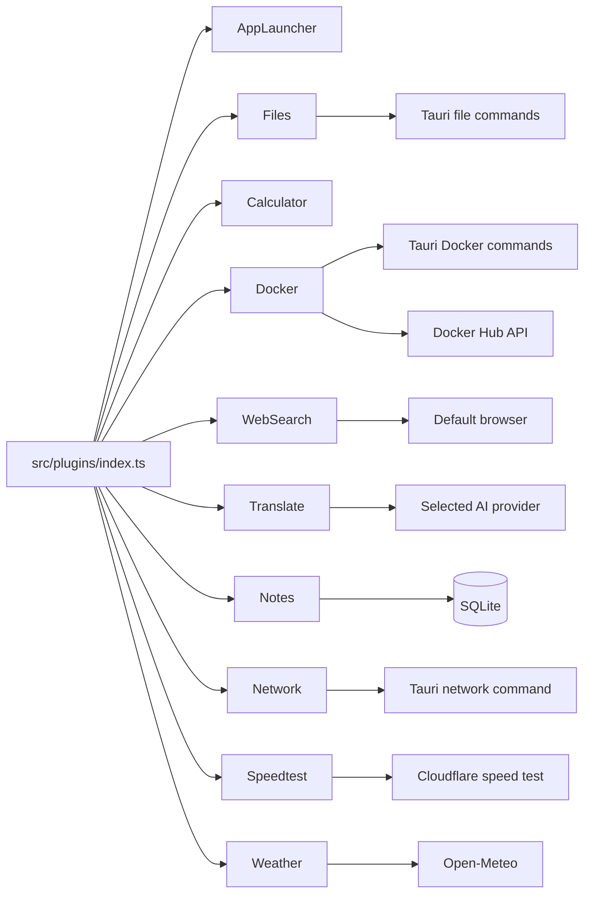

# Current Plugin Catalog

Validated against `src/plugins/index.ts` and plugin source files.

| Plugin | File | Query activation | Capabilities | Backend/API dependencies | AI tools |
|---|---|---|---|---|---|
| Applications | `appLauncher.tsx` | All queries | Cache app list, search by app name, launch selected app, display cached macOS icons when available | `list_apps`, `open_app` | No |
| Files & Folders | `fileSearch.tsx` | Query length >= 2 | Runtime filename/folder search; smart search with AI ranking and safe content previews; open result | `launcher_search_files`, `search_files`, `smart_search_files`, `read_file`, `open_file`; selected AI provider for ranking | `search_files`, `read_file` |
| Calculator | `calculator.tsx` | Math-looking expressions | Safe parser for `+ - * / ()` decimals; copy result and hide | Frontend only | `calculate` |
| Docker | `docker.tsx` | `docker:` prefix only | Open Docker page; list/match local containers/images; container start/stop/restart/remove; image delete/pull; Docker Hub search | Docker Tauri commands; `src/utils/dockerHub.ts` | No |
| Web Search | `webSearch.tsx` | All queries, explicit `search:` prefix | Open Google search URL in default browser | `@tauri-apps/plugin-opener` `openUrl` | No |
| Translate | `translate.tsx` | `translate:`, `/translate`, `translate`, `translation`; quick `t:`/`tr:` handled by `App.tsx` | Inline translation UI and quick translation result/copy flow | Selected AI provider through frontend fetch | No |
| Notes | `notes.tsx` | `note:`, `notes:`, `search notes:`, `note`, `notes`, `memo` | Quick capture; note search; open notes manager; open note by event | SQLite commands in Rust | `search_notes`, `create_note` |
| Network info | `networkInfo.tsx` | `net`, `network`, `net:`, `network:`, `wifi`, `vpn` | Local/public IP, SSID, VPN, latency; cached copy actions | `get_network_info`; public IP from Rust via api.ipify.org | `get_network_info` |
| Speedtest | `speedtest.tsx` | `speedtest`, `speed test`, `internet speed`, `/st` | Cloudflare-based latency/download/upload test with configurable limits and live preview | Cloudflare endpoints from frontend | No |
| Weather | `weather.tsx` | `/wt`, `weather:`, `weather`, `forecast` | Saved/current location weather and 7-day forecast; Open-Meteo geocoding/weather | Open-Meteo frontend fetch | `get_current_weather`, `get_weather_forecast` |

## Plugin interactions

## Important capability boundaries

- Docker is opt-in by prefix to avoid CLI/daemon latency on every launcher query.
- Network info is cached for 45 seconds in frontend.
- File search rejects hidden paths, symlinks, likely secrets/credentials/key files, directories for read, non-text/too-large files, and paths outside searchable roots.
- Speedtest runs entirely in frontend and can be aborted.
- Weather uses public no-key Open-Meteo APIs.
