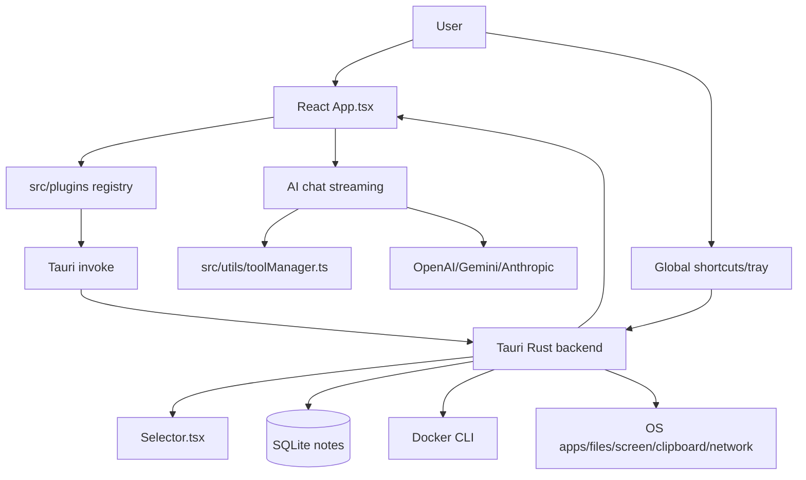

# Project Context

## Overview

GQuick is a cross-platform desktop productivity launcher built with Tauri v2 (Rust backend) and React 19 (TypeScript frontend). It provides Spotlight-like search, plugin actions, AI chat with image input and plugin tool calling, screenshots/OCR, notes, Docker management, weather, network info, file/app search, calculator, web search, translation, speed testing, and terminal helpers.

## Architecture Summary

GQuick uses a Tauri architecture with a React main webview (`App.tsx`) and a fullscreen selector webview (`Selector.tsx`). The Rust backend (`src-tauri/src/lib.rs`) owns global shortcuts, tray/window/focus behavior, OS-level integrations, SQLite notes, Docker CLI operations, screenshot/OCR capture, file/app search/open, dialogs, network info, and terminal execution.

Frontend search is plugin-based. `src/plugins/index.ts` maintains the registry and routes explicit query prefixes to matching plugins; otherwise the launcher runs the registry and sorts `SearchResultItem` results by score. AI chat calls OpenAI, Google Gemini, and Anthropic directly from the frontend; Kimi/Moonshot code paths exist but are not exposed in Settings. It streams responses, converts plugin tool schemas through `src/utils/toolManager.ts`, executes tool calls through plugins, appends tool results, and sends follow-up requests.

## Key Components

- `src/App.tsx`: main launcher/search/chat/settings/actions/notes/docker state machine, plugin orchestration, AI streaming/tool execution, inline terminal UI.
- `src/Selector.tsx`: transparent fullscreen region selector for screenshots/OCR.
- `src/Settings.tsx`: API provider/model/key, global shortcut, and saved location configuration.
- `src/plugins/*`: plugin implementations returning search results/actions/previews; some expose AI tools.
- `src/utils/toolManager.ts`: discovers plugin tools, converts schemas/messages per provider, dispatches tool execution.
- `src/utils/streaming.ts`: SSE streaming for OpenAI/Gemini/Anthropic plus tool-call accumulation.
- `src/utils/location.ts`: reads/writes saved location from `localStorage` for weather and other location-aware plugins.
- `src/components/NotesView.tsx`: CRUD notes manager.
- `src/components/DockerView.tsx`: Docker management UI for status, containers, images, Hub, logs, exec, inspect, prune, Compose.
- `src-tauri/src/lib.rs`: Tauri command surface and cross-platform integrations.

## Plugin Registry

Current registry order:

1. Applications (`appLauncherPlugin`)
2. **Recent Files (`recentFilesPlugin`)** — immediate plugin (no debounce)
3. Files & Folders (`fileSearchPlugin`)
4. Calculator (`calculatorPlugin`)
5. Docker (`dockerPlugin`)
6. Web Search (`webSearchPlugin`)
7. Translate (`translatePlugin`)
8. Notes (`notesPlugin`)
9. Network info (`networkInfoPlugin`)
10. Speedtest (`speedtestPlugin`)
11. Weather (`weatherPlugin`)

`recentFilesPlugin` is an immediate plugin: it reads from `localStorage` usage history (via `usageTracker.ts`) and returns matching recent files/folders with a high score (200) so they rank above filesystem scan results. It does not trigger the searching indicator and its results are deduplicated before debounced plugins.

Current AI tools: `calculate`, `search_files`, `read_file`, `search_notes`, `create_note`, `get_network_info`, `get_current_weather`, `get_weather_forecast`, `web_search`. `get_current_weather` and `get_weather_forecast` use the saved location from Settings as a fallback when no explicit location is provided. Docker, Applications, Recent Files, Translate, and Speedtest do not currently expose plugin AI tools.

## Data Flow

- Search: query → prefix routing via `getPluginsForQuery` → split into immediate (no debounce) and debounced plugins → async `getItems` → deduplicate by `id` (first occurrence wins, immediate results take priority) → score sort → `onSelect`/actions. Immediate plugins do not trigger the searching indicator; only debounced plugins show loading state.
- AI chat: user message/images → collect tools → provider-specific schema/message conversion → SSE stream → execute tool calls → append tool results → follow-up stream.
- File search: runtime `jwalk` scan of safe roots with hidden/system/build/cache skips and no symlink following; smart search adds safe content previews and frontend AI ranking; `read_file` enforces absolute path, safe root, not hidden/secret/symlink, text, and byte caps.
- Recent files: usage tracker records selections in `localStorage` with exponential decay scoring; `recentFilesPlugin` queries `getRecentItemsByPlugin("file-search", 5)` to surface recent files/folders above filesystem results.
- Notes: quick capture/search/plugin tools/NotesView → Rust note commands → SQLite `notes` table.
- Docker: `docker:` plugin and DockerView → Rust Docker commands → validated Docker CLI/Compose operations; Docker Hub search also available through frontend utility and Rust command.
- Screenshot/OCR: global shortcut → selector window → `capture_region` → xcap crop/save to app data dir (`gquick_capture.png`) → clipboard image or OCR text/event/base64 for AI vision.

## Technology Stack

- Frontend: React 19.1, TypeScript 5.8, Vite 7, Tailwind CSS 4, lucide-react, react-markdown + remark-gfm.
- Backend: Tauri 2, Rust, xcap, image, rusqlite bundled SQLite, jwalk/walkdir, rayon, reqwest, tesseract on macOS, unicode-normalization.
- Tauri plugins: opener, clipboard-manager, global-shortcut, dialog.
- External APIs: OpenAI, Google Gemini, Anthropic Claude, with Moonshot/Kimi code-path support, plus Open-Meteo, Cloudflare speed test, Docker Hub, and api.ipify.org.

## Conventions

- Plugins live in `src/plugins/` and implement `GQuickPlugin` from `src/plugins/types.ts`.
- Expensive plugins should use `queryPrefixes`, `shouldSearch`, and debounce.
- Search result scores are descending priority; exact/prefix matches usually score highest.
- Backend commands return `Result<_, String>`; Docker errors use coded JSON strings where applicable.
- Main window hides instead of closing; quit is explicit.
- Destructive Docker operations require explicit confirmation arguments.

## Current Sprint/Focus

Architecture documentation was validated and refreshed for overall functionality, plugin system, AI tool calling, and backend commands. See `arch/README.md` for documentation index. Saved location feature completed: users can configure a default location in Settings, and weather AI tools fall back to it when no location is specified.

**Recent update:** Added `recentFilesPlugin` (immediate plugin, no debounce) that surfaces recently opened files/folders from usage history stored in `localStorage`. Results are deduplicated with debounced plugins and ranked with high score (200) to appear above filesystem scan results. `SearchSuggestions` now shows file-search entries in the unified "Recent" section alongside apps.

**Recent update:** Screenshot capture (`gquick_capture.png`) now saves to the app data directory instead of Desktop. Actions panel cleaned up to show only one trigger per plugin (not all regex alternatives). Plugin keywords trimmed to only words that actually trigger the plugin. macOS app launcher now includes `/Applications/Utilities` and `/System/Applications/Utilities` to discover system utilities (Terminal, Activity Monitor, etc.).

## Key Decisions

- Keep plugin registry explicit and ordered for predictable result priority.
- Keep Docker search opt-in (`docker:`) to avoid Docker CLI/daemon latency on every query.
- Keep AI providers called from frontend using local settings/localStorage; no backend AI proxy currently.
- Enforce file-read safety in Rust, not just frontend, because AI tool args are model-controlled.
- Use runtime file scanning rather than persistent indexing in current code.
