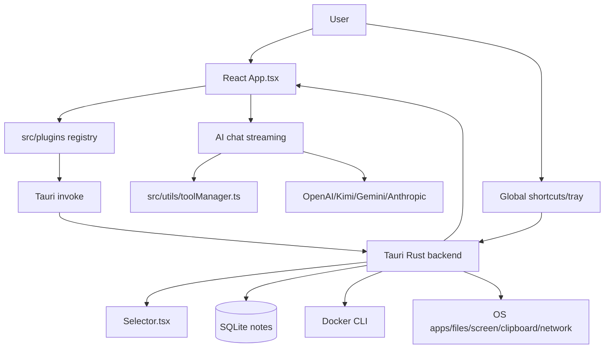

# Project Context

## Overview

GQuick is a cross-platform desktop productivity launcher built with Tauri v2 (Rust backend) and React 19 (TypeScript frontend). It provides Spotlight-like search, plugin actions, AI chat with image input and plugin tool calling, screenshots/OCR, notes, Docker management, weather, network info, file/app search, calculator, web search, translation, speed testing, and terminal helpers.

## Architecture Summary

GQuick uses a Tauri architecture with a React main webview (`App.tsx`) and a fullscreen selector webview (`Selector.tsx`). The Rust backend (`src-tauri/src/lib.rs`) owns global shortcuts, tray/window/focus behavior, OS-level integrations, SQLite notes, Docker CLI operations, screenshot/OCR capture, file/app search/open, dialogs, network info, and terminal execution.

Frontend search is plugin-based. `src/plugins/index.ts` maintains the registry and routes explicit query prefixes to matching plugins; otherwise the launcher runs the registry and sorts `SearchResultItem` results by score. AI chat calls OpenAI/Kimi/Gemini/Anthropic from the frontend, streams responses, converts plugin tool schemas through `src/utils/toolManager.ts`, executes tool calls through plugins, appends tool results, and sends follow-up requests.

## Key Components

- `src/App.tsx`: main launcher/search/chat/settings/actions/notes/docker state machine, plugin orchestration, AI streaming/tool execution, inline terminal UI.
- `src/Selector.tsx`: transparent fullscreen region selector for screenshots/OCR.
- `src/Settings.tsx`: API provider/model/key and global shortcut configuration.
- `src/plugins/*`: plugin implementations returning search results/actions/previews; some expose AI tools.
- `src/utils/toolManager.ts`: discovers plugin tools, converts schemas/messages per provider, dispatches tool execution.
- `src/utils/streaming.ts`: SSE streaming for OpenAI/Kimi/Gemini/Anthropic plus tool-call accumulation.
- `src/components/NotesView.tsx`: CRUD notes manager.
- `src/components/DockerView.tsx`: Docker management UI for status, containers, images, Hub, logs, exec, inspect, prune, Compose.
- `src-tauri/src/lib.rs`: Tauri command surface and cross-platform integrations.

## Plugin Registry

Current registry order:

1. Applications (`appLauncherPlugin`)
2. Files & Folders (`fileSearchPlugin`)
3. Calculator (`calculatorPlugin`)
4. Docker (`dockerPlugin`)
5. Web Search (`webSearchPlugin`)
6. Translate (`translatePlugin`)
7. Notes (`notesPlugin`)
8. Network info (`networkInfoPlugin`)
9. Speedtest (`speedtestPlugin`)
10. Weather (`weatherPlugin`)

Current AI tools: `calculate`, `search_files`, `read_file`, `search_notes`, `create_note`, `get_network_info`, `get_current_weather`, `get_weather_forecast`. Docker, Web Search, Applications, Translate, and Speedtest do not currently expose plugin AI tools.

## Data Flow

- Search: query → prefix routing via `getPluginsForQuery` → plugin `shouldSearch`/debounce → async `getItems` → score sort → `onSelect`/actions.
- AI chat: user message/images → collect tools → provider-specific schema/message conversion → SSE stream → execute tool calls → append tool results → follow-up stream.
- File search: runtime `jwalk` scan of safe roots with hidden/system/build/cache skips and no symlink following; smart search adds safe content previews and frontend AI ranking; `read_file` enforces absolute path, safe root, not hidden/secret/symlink, text, and byte caps.
- Notes: quick capture/search/plugin tools/NotesView → Rust note commands → SQLite `notes` table.
- Docker: `docker:` plugin and DockerView → Rust Docker commands → validated Docker CLI/Compose operations; Docker Hub search also available through frontend utility and Rust command.
- Screenshot/OCR: global shortcut → selector window → `capture_region` → xcap crop/save → clipboard image or OCR text/event/base64 for AI vision.

## Technology Stack

- Frontend: React 19.1, TypeScript 5.8, Vite 7, Tailwind CSS 4, lucide-react, react-markdown + remark-gfm.
- Backend: Tauri 2, Rust, xcap, image, rusqlite bundled SQLite, jwalk/walkdir, rayon, reqwest, tesseract on macOS, unicode-normalization.
- Tauri plugins: opener, clipboard-manager, global-shortcut, dialog.
- External APIs: OpenAI, Moonshot/Kimi, Google Gemini, Anthropic Claude, Open-Meteo, Cloudflare speed test, Docker Hub, api.ipify.org.

## Conventions

- Plugins live in `src/plugins/` and implement `GQuickPlugin` from `src/plugins/types.ts`.
- Expensive plugins should use `queryPrefixes`, `shouldSearch`, and debounce.
- Search result scores are descending priority; exact/prefix matches usually score highest.
- Backend commands return `Result<_, String>`; Docker errors use coded JSON strings where applicable.
- Main window hides instead of closing; quit is explicit.
- Destructive Docker operations require explicit confirmation arguments.

## Current Sprint/Focus

Architecture documentation was validated and refreshed for overall functionality, plugin system, AI tool calling, and backend commands. See `arch/README.md` for documentation index.

## Key Decisions

- Keep plugin registry explicit and ordered for predictable result priority.
- Keep Docker search opt-in (`docker:`) to avoid Docker CLI/daemon latency on every query.
- Keep AI providers called from frontend using local settings/localStorage; no backend AI proxy currently.
- Enforce file-read safety in Rust, not just frontend, because AI tool args are model-controlled.
- Use runtime file scanning rather than persistent indexing in current code.
